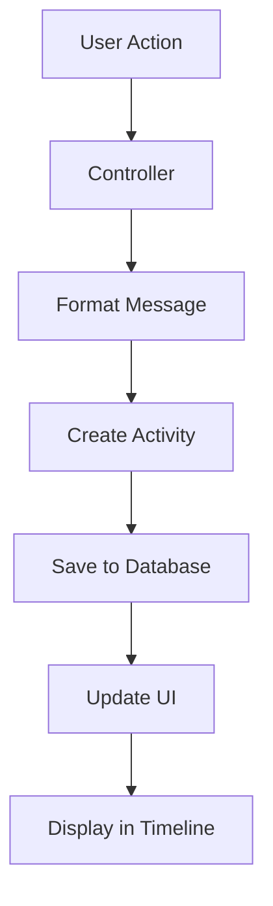

# Activity Log System Documentation

## Overview

The AdminiX project implements a comprehensive activity logging system that tracks all user actions and system events across projects, tasks, meetings, files, and user interactions. This system provides detailed, professional activity messages with rich formatting and real-time updates.

## 📁 File Structure

```
backend/src/
├── models/
│   └── activity.model.ts              # Activity data model
├── controllers/
│   ├── project.controller.ts          # Project activity logging
│   ├── task.controller.ts             # Task activity logging
│   ├── meeting.controller.ts          # Meeting activity logging
│   ├── sprint.controller.ts           # Sprint activity logging
│   └── workspace.controller.ts        # Workspace activity logging
└── services/
    └── activity.service.ts            # Activity business logic

client/src/
├── page/workspace/
│   └── ProjectDetails.tsx             # Activity log display component
├── components/
│   └── ui/
│       └── activity-item.tsx          # Individual activity item
└── hooks/
    └── use-activity-log.tsx           # Activity log state management
```

## 🗄️ Database Schema

### Activity Model (`backend/src/models/activity.model.ts`)

```typescript
interface ActivityDocument extends Document {
  projectId: mongoose.Types.ObjectId;    // Associated project
  userId: mongoose.Types.ObjectId;       // User who performed the action
  type: string;                          // Activity type
  message: string;                       // Formatted activity message
  meta?: Record<string, any>;            // Additional metadata
  pinned: boolean;                       // Pinned status
  createdAt: Date;                       // Creation timestamp
}
```

**Activity Types:**
- `meeting_schedule` - Meeting scheduling and updates
- `task_create` - Task creation
- `task_update` - Task modifications
- `task_delete` - Task deletion
- `project_create` - Project creation
- `project_update` - Project modifications
- `project_delete` - Project deletion
- `sprint_create` - Sprint creation
- `sprint_update` - Sprint modifications
- `sprint_delete` - Sprint deletion
- `file_upload` - File uploads
- `comment_create` - Comment creation
- `comment_edit` - Comment editing
- `comment_delete` - Comment deletion

## 🔧 Backend Implementation

### 1. Activity Creation Patterns

#### Meeting Controller (`backend/src/controllers/meeting.controller.ts`)

```typescript
// Meeting scheduling with detailed activity log
const duration = Math.round((new Date(end).getTime() - new Date(start).getTime()) / (1000 * 60));
const guestCount = guests.length;
const meetingDetails = [
  `📅 ${title}`,
  `⏰ ${formattedStart} - ${formattedEnd} (${duration} min)`,
  guestCount > 0 ? `👥 ${guestCount} attendee${guestCount > 1 ? 's' : ''}` : '',
  description ? `📝 ${description}` : '',
  `🔗 Google Meet link available`
].filter(Boolean).join('\n');

await Activity.create({
  userId,
  projectId,
  type: 'meeting_schedule',
  message: `Scheduled meeting:\n${meetingDetails}`,
});
```

#### Task Controller (`backend/src/controllers/task.controller.ts`)

```typescript
// Task creation with comprehensive details
await Activity.create({
  userId,
  projectId,
  type: 'task_create',
  message: `✅ Task Created\n📋 ${task.title}\n📅 ${format(new Date(), "PPpp")}\n👤 Created by ${req.user?.name || 'User'}\n🎯 Priority: ${task.priority || 'Medium'}\n📝 Status: ${task.status || 'To Do'}`,
});

// Task update with change tracking
const changes = [];
if (oldTask.title !== updatedTask.title) changes.push('title');
if (oldTask.status !== updatedTask.status) changes.push('status');
if (oldTask.priority !== updatedTask.priority) changes.push('priority');

await Activity.create({
  userId,
  projectId,
  type: 'task_update',
  message: `🔄 Task Updated\n📋 ${updatedTask.title}\n📅 ${format(new Date(), "PPpp")}\n👤 Updated by ${req.user?.name || 'User'}\n📝 Changes: ${changes.join(', ')}`,
});
```

#### Project Controller (`backend/src/controllers/project.controller.ts`)

```typescript
// File upload with detailed information
const fileSizeInMB = (file.size / (1024 * 1024)).toFixed(2);
await Activity.create({
  projectId,
  userId,
  type: 'file_upload',
  message: `📁 File Uploaded\n📋 ${name}\n📅 ${format(new Date(), "PPpp")}\n👤 Uploaded by ${req.user?.name || 'User'}\n💾 Size: ${fileSizeInMB} MB`,
  meta: { fileId: fileId, name, size: file.size },
});
```

#### Sprint Controller (`backend/src/controllers/sprint.controller.ts`)

```typescript
// Sprint creation with professional formatting
await Activity.create({
  userId,
  projectId,
  type: 'sprint_create',
  message: `🚀 Sprint Created\n📋 ${sprint.name}\n📅 ${format(new Date(), "PPpp")}\n👤 Created by ${req.user?.name || 'User'}`,
});
```

### 2. Activity Service (`backend/src/services/activity.service.ts`)

```typescript
export class ActivityService {
  // Create activity with automatic formatting
  static async createActivity(data: {
    userId: string;
    projectId: string;
    type: string;
    message: string;
    meta?: Record<string, any>;
  }) {
    const activity = await Activity.create({
      ...data,
      pinned: false,
      createdAt: new Date()
    });

    // Populate user data
    await activity.populate('userId', 'name profilePicture');

    return activity;
  }

  // Get project activities with pagination
  static async getProjectActivities(projectId: string, options: {
    page?: number;
    limit?: number;
    type?: string;
    search?: string;
  }) {
    const { page = 1, limit = 50, type, search } = options;
    const skip = (page - 1) * limit;

    const query: any = { projectId };
    if (type) query.type = type;
    if (search) query.message = { $regex: search, $options: 'i' };

    const activities = await Activity.find(query)
      .populate('userId', 'name profilePicture')
      .sort({ createdAt: -1 })
      .skip(skip)
      .limit(limit);

    const total = await Activity.countDocuments(query);

    return {
      activities,
      pagination: {
        page,
        limit,
        total,
        totalPages: Math.ceil(total / limit)
      }
    };
  }

  // Pin/unpin activity
  static async togglePin(activityId: string, pinned: boolean) {
    return await Activity.findByIdAndUpdate(
      activityId,
      { pinned },
      { new: true }
    ).populate('userId', 'name profilePicture');
  }

  // Get pinned activities for project
  static async getPinnedActivities(projectId: string) {
    return await Activity.find({ projectId, pinned: true })
      .populate('userId', 'name profilePicture')
      .sort({ createdAt: -1 });
  }
}
```

## 🎨 Frontend Implementation

### 1. Activity Log Display (`client/src/page/workspace/ProjectDetails.tsx`)

```typescript
function ActivityLogTab({ onPinChange }: { onPinChange?: () => void }) {
  const [activities, setActivities] = useState<any[]>([]);
  const [loading, setLoading] = useState(false);
  const [filter, setFilter] = useState('all');
  const [search, setSearch] = useState('');

  // Fetch activities
  useEffect(() => {
    if (!projectId) return;
    setLoading(true);
    axios.get(`/api/project/${projectId}/activities`)
      .then(res => setActivities(res.data.activities))
      .catch(() => setError('Failed to load activity log'))
      .finally(() => setLoading(false));
  }, [projectId]);

  // Filter and search activities
  const filteredActivities = activities.filter((a: any) => {
    if (filter === 'comment' && !a.type.includes('comment')) return false;
    if (filter === 'file' && a.type !== 'file_upload') return false;
    if (filter !== 'all' && filter !== 'comment' && filter !== 'file' && a.type !== filter) return false;
    if (search && !a.message.toLowerCase().includes(search.toLowerCase())) return false;
    return true;
  });

  return (
    <div className="py-4 w-full">
      {/* Search and filter controls */}
      <div className="flex items-center gap-2 mb-6">
        <Input
          placeholder="Search activity..."
          value={search}
          onChange={e => setSearch(e.target.value)}
          className="w-48"
        />
        <select
          className="border rounded px-2 py-1 text-sm"
          value={filter}
          onChange={e => setFilter(e.target.value)}
        >
          <option value="all">Show all activity</option>
          <option value="comment">Comments</option>
          <option value="file">Files</option>
          <option value="meeting_schedule">Meetings</option>
          <option value="task_create">Task Created</option>
          <option value="task_update">Task Updated</option>
          <option value="task_delete">Task Deleted</option>
        </select>
      </div>

      {/* Activity timeline */}
      <div className="relative">
        <div className="absolute left-4 top-0 bottom-0 w-0.5 bg-gray-200" />
        <div className="space-y-8 pl-10">
          {grouped[day].map((a: any) => (
            <div key={a._id} className="relative flex gap-3 items-start bg-white rounded-xl border p-4 shadow-sm">
              <div className="absolute left-[-2.1rem] top-6 z-10">
                {getActivityIcon(a.type)}
              </div>
              <div className="flex-1">
                <div className="flex items-center gap-2 mb-1">
                  <Avatar className="w-7 h-7">
                    <AvatarImage src={a.userId?.profilePicture} alt={a.userId?.name} />
                    <AvatarFallback>{a.userId?.name?.[0]}</AvatarFallback>
                  </Avatar>
                  <span className="font-medium text-sm">{a.userId?.name}</span>
                  <span className="text-xs text-gray-400">
                    {formatDistanceToNow(new Date(a.createdAt), { addSuffix: true })}
                  </span>
                  {/* Pin/unpin controls */}
                  {a.pinned ? (
                    <button onClick={() => handleUnpin(a._id)} title="Unpin">
                      <PinOff className="w-4 h-4 text-yellow-500" />
                    </button>
                  ) : (
                    <button onClick={() => handlePin(a._id)} title="Pin">
                      <Pin className="w-4 h-4 text-gray-400 hover:text-yellow-500" />
                    </button>
                  )}
                </div>
                <div className={`text-gray-800 text-sm whitespace-pre-line ${getActivityClass(a.type)}`}>
                  {formatMeetingTime(a.message)}
                </div>
              </div>
            </div>
          ))}
        </div>
      </div>
    </div>
  );
}
```

### 2. Activity Styling (`client/src/index.css`)

```css
/* Activity styling - using dashboard color scheme */
.meeting-activity,
.activity-sprint,
.activity-task,
.activity-project,
.activity-file,
.activity-workspace,
.activity-comment {
  background: hsl(var(--card));
  border: 1px solid hsl(var(--border));
  padding: 12px 16px;
  border-radius: 8px;
  margin: 8px 0;
  font-family: 'Inter', sans-serif;
}

/* Subtle left border accents using dashboard colors */
.meeting-activity { border-left: 4px solid hsl(var(--primary)); }
.activity-sprint { border-left: 4px solid hsl(var(--chart-1)); }
.activity-task { border-left: 4px solid hsl(var(--chart-2)); }
.activity-project { border-left: 4px solid hsl(var(--chart-3)); }
.activity-file { border-left: 4px solid hsl(var(--chart-4)); }
.activity-workspace { border-left: 4px solid hsl(var(--chart-5)); }
.activity-comment { border-left: 4px solid hsl(var(--destructive)); }

/* Text colors using dashboard theme */
.meeting-activity,
.activity-sprint,
.activity-task,
.activity-project,
.activity-file,
.activity-workspace,
.activity-comment {
  color: hsl(var(--foreground));
}
```

### 3. Activity Utility Functions

```typescript
// Get activity CSS class based on type
function getActivityClass(type: string) {
  if (type.includes('meeting')) return 'meeting-activity';
  if (type.includes('sprint')) return 'activity-sprint';
  if (type.includes('task')) return 'activity-task';
  if (type.includes('project')) return 'activity-project';
  if (type.includes('file')) return 'activity-file';
  if (type.includes('workspace')) return 'activity-workspace';
  if (type.includes('comment')) return 'activity-comment';
  return '';
}

// Get activity icon (all black dots for consistency)
function getActivityIcon(type: string) {
  return <span className="block w-3 h-3 rounded-full bg-black" title="Activity" />;
}

// Format meeting time messages
function formatMeetingTime(message: string) {
  // Handle the new professional meeting format
  if (message.includes('Scheduled meeting:') && message.includes('📅')) {
    return message; // Already formatted, return as is
  }
  
  // Handle the old format for backward compatibility
  return message.replace(/\(([^)]+) - ([^)]+)\)/, (match, from, to) => {
    try {
      const formattedFrom = format(new Date(from), "PPpp");
      const formattedTo = format(new Date(to), "PPpp");
      return `(${formattedFrom} - ${formattedTo})`;
    } catch {
      return match;
    }
  });
}

// Group activities by day
function groupByDay(activities: any[]) {
  const groups: Record<string, any[]> = {};
  activities.forEach((a) => {
    const day = format(new Date(a.createdAt), 'PPP');
    if (!groups[day]) groups[day] = [];
    groups[day].push(a);
  });
  return groups;
}
```

## 📊 Activity Message Formats

### Meeting Activities

```typescript
// Meeting Schedule
`Scheduled meeting:
📅 ${title}
⏰ ${formattedStart} - ${formattedEnd} (${duration} min)
👥 ${guestCount} attendee${guestCount > 1 ? 's' : ''}
📝 ${description}
🔗 Google Meet link available`
```

### Task Activities

```typescript
// Task Creation
`✅ Task Created
📋 ${task.title}
📅 ${timestamp}
👤 Created by ${user}
🎯 Priority: ${priority}
📝 Status: ${status}`

// Task Update
`🔄 Task Updated
📋 ${task.title}
📅 ${timestamp}
👤 Updated by ${user}
📝 Changes: ${changes.join(', ')}`

// Task Deletion
`🗑️ Task Deleted
📋 ${task.title}
📅 ${timestamp}
👤 Deleted by ${user}
⚠️ Task ID: ${taskId}`
```

### Project Activities

```typescript
// Project Creation
`🏗️ Project Created
📋 ${project.name}
📅 ${timestamp}
👤 Created by ${user}
📝 ${project.description || 'No description provided'}`

// File Upload
`📁 File Uploaded
📋 ${fileName}
📅 ${timestamp}
👤 Uploaded by ${user}
💾 Size: ${fileSizeInMB} MB`
```

### Sprint Activities

```typescript
// Sprint Creation
`🚀 Sprint Created
📋 ${sprint.name}
📅 ${timestamp}
👤 Created by ${user}`

// Sprint Update
`🔄 Sprint Updated
📋 ${sprint.name}
📅 ${timestamp}
👤 Updated by ${user}`

// Sprint Deletion
`🗑️ Sprint Deleted
📅 ${timestamp}
👤 Deleted by ${user}
⚠️ All associated tasks were also deleted`
```

### Comment Activities

```typescript
// Comment Creation
`💬 Comment Added
📋 ${task.title}
📅 ${timestamp}
👤 Commented by ${user}
💭 ${message.substring(0, 100)}${message.length > 100 ? '...' : ''}`

// Comment Edit
`✏️ Comment Edited
📋 ${task.title}
📅 ${timestamp}
👤 Edited by ${user}
💭 ${message.substring(0, 100)}${message.length > 100 ? '...' : ''}`

// Comment Deletion
`🗑️ Comment Deleted
📋 ${task.title}
📅 ${timestamp}
👤 Deleted by ${user}
💭 Comment removed`
```

## 🔄 Activity Flow

### 1. Activity Creation Flow



### 2. Activity Display Process

1. **Backend Activity Creation:**
   ```typescript
   await Activity.create({
     userId,
     projectId,
     type: 'task_create',
     message: formattedMessage,
     meta: additionalData
   });
   ```

2. **Frontend Activity Fetching:**
   ```typescript
   const response = await axios.get(`/api/project/${projectId}/activities`);
   setActivities(response.data.activities);
   ```

3. **Activity Rendering:**
   - Group by day
   - Apply filters and search
   - Render with appropriate styling
   - Show user avatars and timestamps

## 📈 Activity Statistics

### Types of Activities Tracked:

| Action | Type | Message Format | Frequency |
|--------|------|----------------|-----------|
| Task Creation | `task_create` | Professional multi-line format | High |
| Task Updates | `task_update` | Change tracking included | High |
| File Uploads | `file_upload` | File size and metadata | Medium |
| Meeting Scheduling | `meeting_schedule` | Duration and attendee count | Medium |
| Sprint Management | `sprint_*` | Sprint lifecycle events | Low |
| Comments | `comment_*` | Comment CRUD operations | High |
| Project Changes | `project_*` | Project lifecycle events | Low |

### Activity Storage:

- **Database:** MongoDB with `Activity` collection
- **Persistence:** All activities stored permanently
- **Pinned Status:** Tracked per activity
- **Metadata:** Additional data stored in `meta` field
- **Performance:** Indexed for fast queries

## 🛠️ Configuration

### Environment Variables:

```env
# Activity Log Settings
ACTIVITY_RETENTION_DAYS=365
ACTIVITY_MAX_PER_PROJECT=10000
ACTIVITY_ENABLE_PINNING=true
ACTIVITY_ENABLE_FILTERING=true
```

### Database Indexes:

```typescript
// backend/src/models/activity.model.ts
ActivitySchema.index({ projectId: 1, createdAt: -1 });
ActivitySchema.index({ userId: 1, createdAt: -1 });
ActivitySchema.index({ type: 1, projectId: 1 });
ActivitySchema.index({ pinned: 1, projectId: 1 });
```

## 🧪 Testing Activities

### Unit Tests:

```typescript
describe('ActivityService', () => {
  test('creates activity with correct formatting', async () => {
    const activity = await ActivityService.createActivity({
      userId: 'user123',
      projectId: 'project123',
      type: 'task_create',
      message: '✅ Task Created\n📋 Test Task\n📅 Aug 8, 2025, 11:00:00 AM\n👤 Created by John Doe'
    });

    expect(activity.type).toBe('task_create');
    expect(activity.message).toContain('✅ Task Created');
    expect(activity.pinned).toBe(false);
  });
});
```

### Integration Tests:

```typescript
describe('Activity Integration', () => {
  test('creates activity on task creation', async () => {
    // Create task
    const task = await createTask(taskData);

    // Verify activity was created
    const activities = await Activity.find({ projectId: task.projectId });
    expect(activities).toHaveLength(1);
    expect(activities[0].type).toBe('task_create');
    expect(activities[0].message).toContain('✅ Task Created');
  });
});
```

## 🔧 Maintenance

### Cleanup Old Activities:

```typescript
// Scheduled job to clean old activities
export const cleanupOldActivities = async () => {
  const retentionDays = parseInt(process.env.ACTIVITY_RETENTION_DAYS || '365');
  const cutoffDate = new Date();
  cutoffDate.setDate(cutoffDate.getDate() - retentionDays);

  await Activity.deleteMany({
    createdAt: { $lt: cutoffDate },
    pinned: false // Don't delete pinned activities
  });
};
```

### Activity Analytics:

```typescript
// Get activity statistics
export const getActivityStats = async (projectId: string) => {
  const stats = await Activity.aggregate([
    { $match: { projectId: new ObjectId(projectId) } },
    { $group: {
      _id: '$type',
      count: { $sum: 1 },
      pinned: { $sum: { $cond: ['$pinned', 1, 0] } }
    }}
  ]);
  
  return stats;
};
```

### Export Activities:

```typescript
// Export project activities to CSV
export const exportProjectActivities = async (projectId: string) => {
  const activities = await Activity.find({ projectId })
    .populate('userId', 'name email')
    .sort({ createdAt: -1 });

  const csvData = activities.map(activity => ({
    Date: format(new Date(activity.createdAt), 'yyyy-MM-dd HH:mm:ss'),
    Type: activity.type,
    User: activity.userId.name,
    Message: activity.message.replace(/\n/g, ' '),
    Pinned: activity.pinned ? 'Yes' : 'No'
  }));

  return csvData;
};
```

This activity log system provides comprehensive tracking of all user actions with professional formatting, real-time updates, and powerful filtering capabilities.
