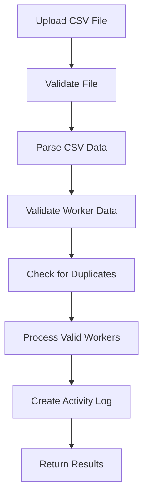

# CSV Worker Import System Documentation

## Overview

The AdminiX project implements a comprehensive CSV worker import system that allows bulk import of workers/employees from CSV files. This system handles file validation, data processing, error handling, and integration with the member management system.

## 📁 File Structure

```
backend/src/
├── models/
│   └── csv-worker.model.ts             # CSV worker data model
├── controllers/
│   └── member.controller.ts             # CSV import operations
├── services/
│   └── csv-import.service.ts           # CSV processing logic
└── utils/
    └── csv-parser.ts                   # CSV parsing utilities

client/src/
├── components/workspace/member/
│   └── import-csv-workers.tsx          # CSV import component
├── hooks/
│   └── use-get-csv-workers.tsx         # CSV worker data fetching
└── utils/
    └── csv-validator.ts                 # Frontend CSV validation
```

## 🗄️ Database Schema

### CSV Worker Model (`backend/src/models/csv-worker.model.ts`)

```typescript
interface CSVWorkerDocument extends Document {
  workspaceId: mongoose.Types.ObjectId;  // Associated workspace
  firstName: string;                      // Worker first name
  lastName: string;                       // Worker last name
  email: string;                          // Worker email
  phone?: string;                         // Worker phone number
  department?: string;                    // Worker department
  position?: string;                      // Worker job position
  employeeId?: string;                    // Employee ID
  hireDate?: Date;                        // Hire date
  salary?: number;                        // Salary information
  status: 'active' | 'inactive' | 'pending';
  importBatch: string;                    // Import batch identifier
  importStatus: 'success' | 'error' | 'pending';
  errorMessage?: string;                  // Import error message
  createdAt: Date;                        // Creation timestamp
  updatedAt: Date;                        // Last update timestamp
}
```

## 🔧 Backend Implementation

### 1. CSV Import Controller (`backend/src/controllers/member.controller.ts`)

```typescript
// CSV file upload and processing
export const importCSVWorkers = asyncHandler(async (req: Request, res: Response) => {
  const { workspaceId } = req.params;
  
  if (!req.file) {
    throw new AppError('No CSV file uploaded', 400);
  }

  const csvData = req.file.buffer.toString();
  const batchId = generateUUID();

  try {
    // Parse CSV data
    const workers = await CSVImportService.parseCSVData(csvData);
    
    // Validate worker data
    const validationResults = await CSVImportService.validateWorkers(workers);
    
    // Process valid workers
    const importResults = await CSVImportService.processWorkers(workers, workspaceId, batchId);
    
    // Create activity log
    await Activity.create({
      userId: req.user?._id,
      workspaceId,
      type: 'csv_import',
      message: `📊 CSV Import Completed\n📋 ${importResults.success} workers imported\n📅 ${format(new Date(), "PPpp")}\n👤 Imported by ${req.user?.name || 'User'}\n⚠️ ${importResults.errors} errors found`,
      meta: { batchId, totalWorkers: workers.length, successCount: importResults.success, errorCount: importResults.errors }
    });

    res.json({
      success: true,
      data: {
        batchId,
        totalWorkers: workers.length,
        successCount: importResults.success,
        errorCount: importResults.errors,
        errors: importResults.errorDetails
      }
    });

  } catch (error) {
    // Create error activity log
    await Activity.create({
      userId: req.user?._id,
      workspaceId,
      type: 'csv_import_error',
      message: `❌ CSV Import Failed\n📅 ${format(new Date(), "PPpp")}\n👤 Attempted by ${req.user?.name || 'User'}\n💬 ${error.message}`,
    });

    throw new AppError(`CSV import failed: ${error.message}`, 400);
  }
});

// Get import results
export const getCSVImportResults = asyncHandler(async (req: Request, res: Response) => {
  const { workspaceId } = req.params;
  const { batchId, status } = req.query;

  const query: any = { workspaceId };
  if (batchId) query.importBatch = batchId;
  if (status) query.importStatus = status;

  const workers = await CSVWorker.find(query)
    .sort({ createdAt: -1 })
    .limit(100);

  const stats = await CSVWorker.aggregate([
    { $match: { workspaceId: new ObjectId(workspaceId) } },
    { $group: {
      _id: '$importStatus',
      count: { $sum: 1 }
    }}
  ]);

  res.json({
    success: true,
    data: {
      workers,
      stats: stats.reduce((acc, stat) => {
        acc[stat._id] = stat.count;
        return acc;
      }, {} as Record<string, number>)
    }
  });
});
```

### 2. CSV Import Service (`backend/src/services/csv-import.service.ts`)

```typescript
export class CSVImportService {
  // Parse CSV data
  static async parseCSVData(csvData: string): Promise<any[]> {
    return new Promise((resolve, reject) => {
      const results: any[] = [];
      const parser = csv.parse(csvData, {
        columns: true,
        skip_empty_lines: true,
        trim: true
      });

      parser.on('data', (data) => {
        results.push(data);
      });

      parser.on('end', () => {
        resolve(results);
      });

      parser.on('error', (error) => {
        reject(new Error(`CSV parsing error: ${error.message}`));
      });
    });
  }

  // Validate worker data
  static async validateWorkers(workers: any[]): Promise<ValidationResult[]> {
    const results: ValidationResult[] = [];

    for (let i = 0; i < workers.length; i++) {
      const worker = workers[i];
      const rowNumber = i + 2; // +2 because of header row and 0-based index
      const errors: string[] = [];

      // Required fields validation
      if (!worker.firstName || !worker.firstName.trim()) {
        errors.push('First name is required');
      }
      if (!worker.lastName || !worker.lastName.trim()) {
        errors.push('Last name is required');
      }
      if (!worker.email || !worker.email.trim()) {
        errors.push('Email is required');
      } else if (!isValidEmail(worker.email)) {
        errors.push('Invalid email format');
      }

      // Optional field validation
      if (worker.phone && !isValidPhone(worker.phone)) {
        errors.push('Invalid phone number format');
      }
      if (worker.salary && isNaN(Number(worker.salary))) {
        errors.push('Invalid salary format');
      }
      if (worker.hireDate && !isValidDate(worker.hireDate)) {
        errors.push('Invalid hire date format');
      }

      results.push({
        rowNumber,
        worker,
        isValid: errors.length === 0,
        errors
      });
    }

    return results;
  }

  // Process workers for import
  static async processWorkers(workers: any[], workspaceId: string, batchId: string): Promise<ImportResult> {
    let successCount = 0;
    let errorCount = 0;
    const errorDetails: ImportError[] = [];

    for (const worker of workers) {
      try {
        // Check for duplicate email
        const existingWorker = await CSVWorker.findOne({
          workspaceId,
          email: worker.email.toLowerCase()
        });

        if (existingWorker) {
          errorCount++;
          errorDetails.push({
            rowNumber: worker.rowNumber,
            email: worker.email,
            error: 'Email already exists in workspace'
          });
          continue;
        }

        // Create worker record
        await CSVWorker.create({
          workspaceId,
          firstName: worker.firstName.trim(),
          lastName: worker.lastName.trim(),
          email: worker.email.toLowerCase().trim(),
          phone: worker.phone?.trim(),
          department: worker.department?.trim(),
          position: worker.position?.trim(),
          employeeId: worker.employeeId?.trim(),
          hireDate: worker.hireDate ? new Date(worker.hireDate) : undefined,
          salary: worker.salary ? Number(worker.salary) : undefined,
          status: 'pending',
          importBatch: batchId,
          importStatus: 'success'
        });

        successCount++;

      } catch (error) {
        errorCount++;
        errorDetails.push({
          rowNumber: worker.rowNumber,
          email: worker.email,
          error: error.message
        });
      }
    }

    return {
      success: successCount,
      errors: errorCount,
      errorDetails
    };
  }

  // Generate CSV template
  static generateCSVTemplate(): string {
    const headers = [
      'firstName',
      'lastName', 
      'email',
      'phone',
      'department',
      'position',
      'employeeId',
      'hireDate',
      'salary'
    ];

    const sampleData = [
      'John',
      'Doe',
      'john.doe@example.com',
      '+1234567890',
      'Engineering',
      'Software Developer',
      'EMP001',
      '2025-01-15',
      '75000'
    ];

    return [headers.join(','), sampleData.join(',')].join('\n');
  }

  // Export import results
  static async exportImportResults(workspaceId: string, batchId: string): Promise<string> {
    const workers = await CSVWorker.find({ workspaceId, importBatch: batchId })
      .sort({ createdAt: 1 });

    const headers = [
      'Row',
      'First Name',
      'Last Name',
      'Email',
      'Phone',
      'Department',
      'Position',
      'Employee ID',
      'Hire Date',
      'Salary',
      'Status',
      'Error Message'
    ];

    const rows = workers.map((worker, index) => [
      index + 1,
      worker.firstName,
      worker.lastName,
      worker.email,
      worker.phone || '',
      worker.department || '',
      worker.position || '',
      worker.employeeId || '',
      worker.hireDate ? format(worker.hireDate, 'yyyy-MM-dd') : '',
      worker.salary || '',
      worker.importStatus,
      worker.errorMessage || ''
    ]);

    return [headers.join(','), ...rows.map(row => row.join(','))].join('\n');
  }
}
```

### 3. CSV Parser Utilities (`backend/src/utils/csv-parser.ts`)

```typescript
// Email validation
export const isValidEmail = (email: string): boolean => {
  const emailRegex = /^[^\s@]+@[^\s@]+\.[^\s@]+$/;
  return emailRegex.test(email);
};

// Phone validation
export const isValidPhone = (phone: string): boolean => {
  const phoneRegex = /^[\+]?[1-9][\d]{0,15}$/;
  return phoneRegex.test(phone.replace(/[\s\-\(\)]/g, ''));
};

// Date validation
export const isValidDate = (date: string): boolean => {
  const parsedDate = new Date(date);
  return !isNaN(parsedDate.getTime());
};

// Sanitize CSV data
export const sanitizeCSVData = (data: any): any => {
  const sanitized: any = {};
  
  for (const [key, value] of Object.entries(data)) {
    if (typeof value === 'string') {
      sanitized[key] = value.trim();
    } else {
      sanitized[key] = value;
    }
  }
  
  return sanitized;
};

// Generate UUID for batch tracking
export const generateUUID = (): string => {
  return 'xxxxxxxx-xxxx-4xxx-yxxx-xxxxxxxxxxxx'.replace(/[xy]/g, function(c) {
    const r = Math.random() * 16 | 0;
    const v = c === 'x' ? r : (r & 0x3 | 0x8);
    return v.toString(16);
  });
};
```

## 🎨 Frontend Implementation

### 1. CSV Import Component (`client/src/components/workspace/member/import-csv-workers.tsx`)

```typescript
export const ImportCSVWorkers: React.FC = () => {
  const [file, setFile] = useState<File | null>(null);
  const [uploading, setUploading] = useState(false);
  const [importResults, setImportResults] = useState<any>(null);
  const [errors, setErrors] = useState<string[]>([]);

  const handleFileSelect = (selectedFile: File) => {
    // Validate file type
    if (!selectedFile.name.endsWith('.csv')) {
      setErrors(['Please select a valid CSV file']);
      return;
    }

    // Validate file size (max 5MB)
    if (selectedFile.size > 5 * 1024 * 1024) {
      setErrors(['File size must be less than 5MB']);
      return;
    }

    setFile(selectedFile);
    setErrors([]);
  };

  const handleFileUpload = async () => {
    if (!file) return;

    setUploading(true);
    setErrors([]);

    try {
      const formData = new FormData();
      formData.append('csvFile', file);

      const response = await axios.post(
        `/api/workspace/${workspaceId}/import-csv-workers`,
        formData,
        {
          headers: {
            'Content-Type': 'multipart/form-data'
          }
        }
      );

      setImportResults(response.data.data);
      toast.success(`Successfully imported ${response.data.data.successCount} workers`);

      if (response.data.data.errorCount > 0) {
        toast.warning(`${response.data.data.errorCount} workers had import errors`);
      }

    } catch (error) {
      const errorMessage = error.response?.data?.message || 'Failed to import CSV file';
      setErrors([errorMessage]);
      toast.error(errorMessage);
    } finally {
      setUploading(false);
    }
  };

  const handleDownloadTemplate = () => {
    const template = `firstName,lastName,email,phone,department,position,employeeId,hireDate,salary
John,Doe,john.doe@example.com,+1234567890,Engineering,Software Developer,EMP001,2025-01-15,75000
Jane,Smith,jane.smith@example.com,+1234567891,Marketing,Marketing Manager,EMP002,2025-01-20,65000`;

    const blob = new Blob([template], { type: 'text/csv' });
    const url = window.URL.createObjectURL(blob);
    const a = document.createElement('a');
    a.href = url;
    a.download = 'workers_template.csv';
    a.click();
    window.URL.revokeObjectURL(url);
  };

  const handleDownloadResults = async () => {
    if (!importResults?.batchId) return;

    try {
      const response = await axios.get(
        `/api/workspace/${workspaceId}/export-import-results/${importResults.batchId}`,
        { responseType: 'blob' }
      );

      const url = window.URL.createObjectURL(response.data);
      const a = document.createElement('a');
      a.href = url;
      a.download = `import_results_${importResults.batchId}.csv`;
      a.click();
      window.URL.revokeObjectURL(url);

    } catch (error) {
      toast.error('Failed to download import results');
    }
  };

  return (
    <div className="space-y-6">
      {/* Import Header */}
      <div className="flex items-center justify-between">
        <div>
          <h2 className="text-2xl font-bold">Import Workers from CSV</h2>
          <p className="text-gray-600">Bulk import workers using a CSV file</p>
        </div>
        <Button onClick={handleDownloadTemplate} variant="outline">
          <Download className="h-4 w-4 mr-2" />
          Download Template
        </Button>
      </div>

      {/* File Upload */}
      <div className="bg-white rounded-lg border p-6">
        <div className="space-y-4">
          <div>
            <label className="block text-sm font-medium text-gray-700 mb-2">
              Select CSV File
            </label>
            <input
              type="file"
              accept=".csv"
              onChange={(e) => handleFileSelect(e.target.files?.[0] || null)}
              className="block w-full text-sm text-gray-500 file:mr-4 file:py-2 file:px-4 file:rounded-full file:border-0 file:text-sm file:font-semibold file:bg-blue-50 file:text-blue-700 hover:file:bg-blue-100"
            />
          </div>

          {errors.length > 0 && (
            <div className="bg-red-50 border border-red-200 rounded-md p-4">
              <div className="flex">
                <AlertCircle className="h-5 w-5 text-red-400" />
                <div className="ml-3">
                  <h3 className="text-sm font-medium text-red-800">
                    Import Errors
                  </h3>
                  <div className="mt-2 text-sm text-red-700">
                    <ul className="list-disc pl-5 space-y-1">
                      {errors.map((error, index) => (
                        <li key={index}>{error}</li>
                      ))}
                    </ul>
                  </div>
                </div>
              </div>
            </div>
          )}

          <Button
            onClick={handleFileUpload}
            disabled={!file || uploading}
            className="w-full"
          >
            {uploading ? (
              <>
                <Loader2 className="h-4 w-4 mr-2 animate-spin" />
                Importing...
              </>
            ) : (
              <>
                <Upload className="h-4 w-4 mr-2" />
                Import Workers
              </>
            )}
          </Button>
        </div>
      </div>

      {/* Import Results */}
      {importResults && (
        <div className="bg-white rounded-lg border p-6">
          <h3 className="text-lg font-semibold mb-4">Import Results</h3>
          
          <div className="grid grid-cols-1 md:grid-cols-3 gap-4 mb-6">
            <div className="bg-green-50 border border-green-200 rounded-lg p-4">
              <div className="flex items-center">
                <CheckCircle className="h-8 w-8 text-green-400" />
                <div className="ml-3">
                  <p className="text-sm font-medium text-green-800">Successfully Imported</p>
                  <p className="text-2xl font-bold text-green-900">{importResults.successCount}</p>
                </div>
              </div>
            </div>

            <div className="bg-red-50 border border-red-200 rounded-lg p-4">
              <div className="flex items-center">
                <XCircle className="h-8 w-8 text-red-400" />
                <div className="ml-3">
                  <p className="text-sm font-medium text-red-800">Import Errors</p>
                  <p className="text-2xl font-bold text-red-900">{importResults.errorCount}</p>
                </div>
              </div>
            </div>

            <div className="bg-blue-50 border border-blue-200 rounded-lg p-4">
              <div className="flex items-center">
                <FileText className="h-8 w-8 text-blue-400" />
                <div className="ml-3">
                  <p className="text-sm font-medium text-blue-800">Total Processed</p>
                  <p className="text-2xl font-bold text-blue-900">{importResults.totalWorkers}</p>
                </div>
              </div>
            </div>
          </div>

          {importResults.errorDetails && importResults.errorDetails.length > 0 && (
            <div className="space-y-4">
              <h4 className="font-medium text-gray-900">Error Details</h4>
              <div className="bg-gray-50 rounded-lg p-4 max-h-60 overflow-y-auto">
                <table className="min-w-full">
                  <thead>
                    <tr className="border-b border-gray-200">
                      <th className="text-left text-xs font-medium text-gray-500 uppercase tracking-wider">Row</th>
                      <th className="text-left text-xs font-medium text-gray-500 uppercase tracking-wider">Email</th>
                      <th className="text-left text-xs font-medium text-gray-500 uppercase tracking-wider">Error</th>
                    </tr>
                  </thead>
                  <tbody className="bg-white divide-y divide-gray-200">
                    {importResults.errorDetails.map((error: any, index: number) => (
                      <tr key={index}>
                        <td className="px-6 py-4 whitespace-nowrap text-sm text-gray-900">{error.rowNumber}</td>
                        <td className="px-6 py-4 whitespace-nowrap text-sm text-gray-900">{error.email}</td>
                        <td className="px-6 py-4 text-sm text-red-600">{error.error}</td>
                      </tr>
                    ))}
                  </tbody>
                </table>
              </div>
            </div>
          )}

          <div className="flex gap-4 mt-6">
            <Button onClick={handleDownloadResults} variant="outline">
              <Download className="h-4 w-4 mr-2" />
              Download Results
            </Button>
            <Button onClick={() => setImportResults(null)} variant="outline">
              <X className="h-4 w-4 mr-2" />
              Clear Results
            </Button>
          </div>
        </div>
      )}
    </div>
  );
};
```

### 2. CSV Validation Utilities (`client/src/utils/csv-validator.ts`)

```typescript
// Frontend CSV validation
export const validateCSVFile = (file: File): string[] => {
  const errors: string[] = [];

  // Check file type
  if (!file.name.endsWith('.csv')) {
    errors.push('File must be a CSV file');
  }

  // Check file size (max 5MB)
  if (file.size > 5 * 1024 * 1024) {
    errors.push('File size must be less than 5MB');
  }

  return errors;
};

// Preview CSV data
export const previewCSVData = async (file: File): Promise<any[]> => {
  return new Promise((resolve, reject) => {
    const reader = new FileReader();
    
    reader.onload = (e) => {
      try {
        const csv = e.target?.result as string;
        const lines = csv.split('\n');
        const headers = lines[0].split(',');
        const data = lines.slice(1, 6).map(line => {
          const values = line.split(',');
          const row: any = {};
          headers.forEach((header, index) => {
            row[header.trim()] = values[index]?.trim() || '';
          });
          return row;
        });
        resolve(data);
      } catch (error) {
        reject(new Error('Failed to parse CSV file'));
      }
    };

    reader.onerror = () => reject(new Error('Failed to read file'));
    reader.readAsText(file);
  });
};
```

## 📊 Import Analytics

### Import Statistics

```typescript
// Calculate import metrics
const calculateImportMetrics = (importResults: any[]) => {
  const totalImports = importResults.length;
  const successfulImports = importResults.filter(r => r.successCount > 0).length;
  const failedImports = importResults.filter(r => r.errorCount > 0).length;

  const totalWorkers = importResults.reduce((sum, r) => sum + r.totalWorkers, 0);
  const totalSuccess = importResults.reduce((sum, r) => sum + r.successCount, 0);
  const totalErrors = importResults.reduce((sum, r) => sum + r.errorCount, 0);

  return {
    totalImports,
    successfulImports,
    failedImports,
    totalWorkers,
    totalSuccess,
    totalErrors,
    successRate: totalWorkers > 0 ? (totalSuccess / totalWorkers) * 100 : 0
  };
};
```

### Error Analysis

```typescript
// Analyze common import errors
const analyzeImportErrors = (errorDetails: any[]) => {
  const errorCounts: Record<string, number> = {};
  
  errorDetails.forEach(error => {
    const errorType = error.error.split(':')[0];
    errorCounts[errorType] = (errorCounts[errorType] || 0) + 1;
  });

  return Object.entries(errorCounts)
    .map(([error, count]) => ({ error, count }))
    .sort((a, b) => b.count - a.count);
};
```

## 🔄 Import Workflow

### 1. CSV Import Process



### 2. Import States

| State | Description | Actions Available |
|-------|-------------|------------------|
| `pending` | Import in progress | Monitor progress |
| `success` | Worker imported successfully | View details |
| `error` | Import failed | View error details |

## 🛠️ Configuration

### Environment Variables

```env
# CSV Import Settings
CSV_MAX_FILE_SIZE=5242880
CSV_MAX_WORKERS_PER_IMPORT=1000
CSV_ALLOWED_COLUMNS=firstName,lastName,email,phone,department,position,employeeId,hireDate,salary
CSV_REQUIRED_COLUMNS=firstName,lastName,email
```

### Database Indexes

```typescript
// backend/src/models/csv-worker.model.ts
CSVWorkerSchema.index({ workspaceId: 1, email: 1 });
CSVWorkerSchema.index({ workspaceId: 1, importBatch: 1 });
CSVWorkerSchema.index({ workspaceId: 1, importStatus: 1 });
CSVWorkerSchema.index({ workspaceId: 1, createdAt: -1 });
```

## 🧪 Testing CSV Import

### Unit Tests

```typescript
describe('CSVImportService', () => {
  test('parses valid CSV data', async () => {
    const csvData = `firstName,lastName,email
John,Doe,john.doe@example.com
Jane,Smith,jane.smith@example.com`;

    const workers = await CSVImportService.parseCSVData(csvData);
    expect(workers).toHaveLength(2);
    expect(workers[0].firstName).toBe('John');
  });

  test('validates worker data correctly', async () => {
    const workers = [
      { firstName: 'John', lastName: 'Doe', email: 'john@example.com' },
      { firstName: '', lastName: 'Smith', email: 'invalid-email' }
    ];

    const results = await CSVImportService.validateWorkers(workers);
    expect(results[0].isValid).toBe(true);
    expect(results[1].isValid).toBe(false);
    expect(results[1].errors).toContain('First name is required');
    expect(results[1].errors).toContain('Invalid email format');
  });
});
```

### Integration Tests

```typescript
describe('CSV Import Integration', () => {
  test('imports workers from CSV file', async () => {
    const csvData = `firstName,lastName,email,department
John,Doe,john.doe@example.com,Engineering
Jane,Smith,jane.smith@example.com,Marketing`;

    const response = await request(app)
      .post(`/api/workspace/${workspaceId}/import-csv-workers`)
      .attach('csvFile', Buffer.from(csvData), 'workers.csv')
      .set('Authorization', `Bearer ${token}`);

    expect(response.status).toBe(200);
    expect(response.body.data.successCount).toBe(2);
    expect(response.body.data.errorCount).toBe(0);
  });
});
```

## 🔧 Maintenance

### Import Cleanup

```typescript
// Clean up old import records
export const cleanupOldImports = async () => {
  const cutoffDate = subMonths(new Date(), 6);
  
  await CSVWorker.deleteMany({
    createdAt: { $lt: cutoffDate },
    importStatus: 'error'
  });
};
```

### Import Analytics

```typescript
// Get import performance metrics
export const getImportAnalytics = async (workspaceId: string) => {
  const analytics = await CSVWorker.aggregate([
    { $match: { workspaceId: new ObjectId(workspaceId) } },
    { $group: {
      _id: '$importStatus',
      count: { $sum: 1 },
      avgWorkersPerBatch: { $avg: '$importBatch' }
    }}
  ]);
  
  return analytics;
};
```

This CSV worker import system provides comprehensive bulk import capabilities with detailed validation, error handling, and analytics tracking.
