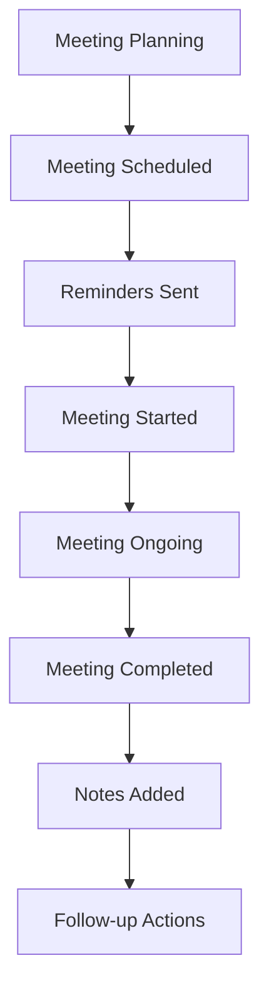

# Meeting System Documentation

## Overview

The AdminiX project implements a comprehensive meeting management system that handles meeting scheduling, Google Meet integration, attendee management, and detailed activity logging. This system provides professional meeting scheduling with real-time notifications and calendar integration.

## 📁 File Structure

```
backend/src/
├── models/
│   └── meeting.model.ts                # Meeting data model
├── controllers/
│   └── meeting.controller.ts           # Meeting CRUD operations
├── services/
│   └── meeting.service.ts              # Meeting business logic
└── validation/
    └── meeting.validation.ts           # Meeting data validation

client/src/
├── page/workspace/
│   └── ScheduleMeeting.tsx             # Meeting scheduling page
├── components/workspace/meeting/
│   ├── meeting-scheduler.tsx           # Meeting creation component
│   ├── meeting-list.tsx                # Meeting display component
│   ├── meeting-details.tsx             # Meeting details modal
│   └── google-meet-integration.tsx     # Google Meet integration
└── hooks/
    └── use-meetings.tsx                # Meeting data fetching
```

## 🗄️ Database Schema

### Meeting Model (`backend/src/models/meeting.model.ts`)

```typescript
interface MeetingDocument extends Document {
  title: string;                         // Meeting title
  description?: string;                  // Meeting description
  projectId: mongoose.Types.ObjectId;    // Associated project
  workspaceId: mongoose.Types.ObjectId;  // Associated workspace
  start: Date;                           // Meeting start time
  end: Date;                             // Meeting end time
  attendees: mongoose.Types.ObjectId[];  // Meeting attendees
  organizer: mongoose.Types.ObjectId;    // Meeting organizer
  googleMeetLink?: string;               // Google Meet link
  status: 'scheduled' | 'ongoing' | 'completed' | 'cancelled';
  meetingType: 'team' | 'client' | 'review' | 'planning';
  location?: string;                     // Meeting location
  notes?: string;                        // Meeting notes
  createdAt: Date;                       // Creation timestamp
  updatedAt: Date;                       // Last update timestamp
}
```

## 🔧 Backend Implementation

### 1. Meeting Controller (`backend/src/controllers/meeting.controller.ts`)

```typescript
// Meeting scheduling with detailed activity logging
export const scheduleMeeting = asyncHandler(async (req: Request, res: Response) => {
  const { title, description, start, end, attendees, meetingType, location } = req.body;
  const { projectId } = req.params;

  // Calculate meeting duration
  const duration = Math.round((new Date(end).getTime() - new Date(start).getTime()) / (1000 * 60));
  const guestCount = attendees.length;

  // Generate Google Meet link
  const googleMeetLink = await generateGoogleMeetLink();

  const meeting = await Meeting.create({
    title,
    description,
    projectId,
    workspaceId: req.user?.workspaceId,
    start,
    end,
    attendees,
    organizer: req.user?._id,
    googleMeetLink,
    status: 'scheduled',
    meetingType,
    location
  });

  // Create detailed activity log
  const meetingDetails = [
    `📅 ${title}`,
    `⏰ ${format(new Date(start), "PPpp")} - ${format(new Date(end), "PPpp")} (${duration} min)`,
    guestCount > 0 ? `👥 ${guestCount} attendee${guestCount > 1 ? 's' : ''}` : '',
    description ? `📝 ${description}` : '',
    `🔗 Google Meet link available`
  ].filter(Boolean).join('\n');

  await Activity.create({
    userId: req.user?._id,
    projectId,
    type: 'meeting_schedule',
    message: `Scheduled meeting:\n${meetingDetails}`,
  });

  // Send notifications to attendees
  for (const attendeeId of attendees) {
    if (attendeeId.toString() !== req.user?._id.toString()) {
      await Notification.create({
        userId: attendeeId,
        workspaceId: req.user?.workspaceId,
        type: 'meeting',
        message: `Meeting "${title}" scheduled for ${format(new Date(start), "PPpp")}`,
        data: { meetingId: meeting._id, start, end }
      });
    }
  }

  res.status(201).json({ success: true, data: meeting });
});

// Meeting update with change tracking
export const updateMeeting = asyncHandler(async (req: Request, res: Response) => {
  const { meetingId } = req.params;
  const updates = req.body;

  const oldMeeting = await Meeting.findById(meetingId);
  const meeting = await Meeting.findByIdAndUpdate(meetingId, updates, { new: true });

  await Activity.create({
    userId: req.user?._id,
    projectId: meeting.projectId,
    type: 'meeting_update',
    message: `🔄 Meeting Updated\n📅 ${meeting.title}\n📅 ${format(new Date(), "PPpp")}\n👤 Updated by ${req.user?.name || 'User'}`,
  });

  res.json({ success: true, data: meeting });
});

// Meeting cancellation
export const cancelMeeting = asyncHandler(async (req: Request, res: Response) => {
  const { meetingId } = req.params;

  const meeting = await Meeting.findByIdAndUpdate(meetingId, { status: 'cancelled' }, { new: true });

  await Activity.create({
    userId: req.user?._id,
    projectId: meeting.projectId,
    type: 'meeting_cancel',
    message: `❌ Meeting Cancelled\n📅 ${meeting.title}\n📅 ${format(new Date(), "PPpp")}\n👤 Cancelled by ${req.user?.name || 'User'}`,
  });

  res.json({ success: true, message: 'Meeting cancelled successfully' });
});
```

### 2. Meeting Service (`backend/src/services/meeting.service.ts`)

```typescript
export class MeetingService {
  // Generate Google Meet link
  static async generateGoogleMeetLink(): Promise<string> {
    // Implementation for Google Meet API integration
    const meetId = generateRandomString(10);
    return `https://meet.google.com/${meetId}`;
  }

  // Check for meeting conflicts
  static async checkMeetingConflicts(data: {
    start: Date;
    end: Date;
    attendees: string[];
    excludeMeetingId?: string;
  }) {
    const { start, end, attendees, excludeMeetingId } = data;

    const query: any = {
      attendees: { $in: attendees },
      status: { $ne: 'cancelled' },
      $or: [
        {
          start: { $lt: end },
          end: { $gt: start }
        }
      ]
    };

    if (excludeMeetingId) {
      query._id = { $ne: excludeMeetingId };
    }

    const conflicts = await Meeting.find(query);
    return conflicts;
  }

  // Get user's meetings
  static async getUserMeetings(userId: string, options: {
    status?: string;
    startDate?: Date;
    endDate?: Date;
  }) {
    const { status, startDate, endDate } = options;

    const query: any = {
      $or: [
        { attendees: userId },
        { organizer: userId }
      ]
    };

    if (status) query.status = status;
    if (startDate) query.start = { $gte: startDate };
    if (endDate) query.end = { $lte: endDate };

    return await Meeting.find(query)
      .populate('attendees', 'name email profilePicture')
      .populate('organizer', 'name email profilePicture')
      .populate('projectId', 'name')
      .sort({ start: 1 });
  }

  // Get project meetings
  static async getProjectMeetings(projectId: string) {
    return await Meeting.find({ projectId })
      .populate('attendees', 'name email profilePicture')
      .populate('organizer', 'name email profilePicture')
      .sort({ start: 1 });
  }

  // Send meeting reminders
  static async sendMeetingReminders() {
    const now = new Date();
    const reminderTime = addMinutes(now, 15); // 15 minutes before meeting

    const upcomingMeetings = await Meeting.find({
      start: { $gte: now, $lte: reminderTime },
      status: 'scheduled'
    }).populate('attendees');

    for (const meeting of upcomingMeetings) {
      for (const attendee of meeting.attendees) {
        await Notification.create({
          userId: attendee._id,
          workspaceId: meeting.workspaceId,
          type: 'meeting_reminder',
          message: `⏰ Meeting Reminder: "${meeting.title}" starts in 15 minutes`,
          data: { meetingId: meeting._id, start: meeting.start }
        });
      }
    }
  }
}
```

### 3. Meeting Validation (`backend/src/validation/meeting.validation.ts`)

```typescript
import Joi from 'joi';

export const scheduleMeetingSchema = Joi.object({
  title: Joi.string().required().min(3).max(200),
  description: Joi.string().max(1000),
  start: Joi.date().required(),
  end: Joi.date().required().greater(Joi.ref('start')),
  attendees: Joi.array().items(Joi.string().hex().length(24)).min(1),
  meetingType: Joi.string().valid('team', 'client', 'review', 'planning').required(),
  location: Joi.string().max(200)
});

export const updateMeetingSchema = Joi.object({
  title: Joi.string().min(3).max(200),
  description: Joi.string().max(1000),
  start: Joi.date(),
  end: Joi.date(),
  attendees: Joi.array().items(Joi.string().hex().length(24)),
  meetingType: Joi.string().valid('team', 'client', 'review', 'planning'),
  location: Joi.string().max(200),
  status: Joi.string().valid('scheduled', 'ongoing', 'completed', 'cancelled')
});
```

## 🎨 Frontend Implementation

### 1. Meeting Scheduler Component (`client/src/page/workspace/ScheduleMeeting.tsx`)

```typescript
export const ScheduleMeeting: React.FC = () => {
  const [meetings, setMeetings] = useState<Meeting[]>([]);
  const [loading, setLoading] = useState(false);
  const [selectedMeeting, setSelectedMeeting] = useState<Meeting | null>(null);

  // Fetch meetings
  const { data: meetingsData, refetch } = useGetMeetings(projectId);

  useEffect(() => {
    if (meetingsData) {
      setMeetings(meetingsData);
    }
  }, [meetingsData]);

  const handleScheduleMeeting = async (meetingData: CreateMeetingData) => {
    try {
      await axios.post(`/api/project/${projectId}/meetings`, meetingData);
      refetch();
      toast.success('Meeting scheduled successfully');
    } catch (error) {
      toast.error('Failed to schedule meeting');
    }
  };

  const handleUpdateMeeting = async (meetingId: string, updates: Partial<Meeting>) => {
    try {
      await axios.patch(`/api/meeting/${meetingId}`, updates);
      refetch();
      toast.success('Meeting updated successfully');
    } catch (error) {
      toast.error('Failed to update meeting');
    }
  };

  const handleCancelMeeting = async (meetingId: string) => {
    try {
      await axios.patch(`/api/meeting/${meetingId}/cancel`);
      refetch();
      toast.success('Meeting cancelled successfully');
    } catch (error) {
      toast.error('Failed to cancel meeting');
    }
  };

  return (
    <div className="space-y-6">
      {/* Meeting Header */}
      <div className="flex items-center justify-between">
        <div>
          <h2 className="text-2xl font-bold">Meeting Schedule</h2>
          <p className="text-gray-600">Schedule and manage team meetings</p>
        </div>
        <MeetingScheduler onScheduleMeeting={handleScheduleMeeting} />
      </div>

      {/* Meeting Calendar View */}
      <div className="bg-white rounded-lg border p-6">
        <Calendar
          mode="single"
          selected={selectedDate}
          onSelect={setSelectedDate}
          className="rounded-md border"
        />
      </div>

      {/* Meeting List */}
      <div className="space-y-4">
        <h3 className="text-lg font-semibold">Upcoming Meetings</h3>
        {meetings.map((meeting) => (
          <MeetingCard
            key={meeting._id}
            meeting={meeting}
            onUpdate={handleUpdateMeeting}
            onCancel={handleCancelMeeting}
            onSelect={setSelectedMeeting}
          />
        ))}
      </div>

      {/* Meeting Details Modal */}
      {selectedMeeting && (
        <MeetingDetailsDialog
          meeting={selectedMeeting}
          onClose={() => setSelectedMeeting(null)}
          onUpdate={handleUpdateMeeting}
        />
      )}
    </div>
  );
};
```

### 2. Meeting Card Component

```typescript
const MeetingCard: React.FC<{ meeting: Meeting; onUpdate: (id: string, data: any) => void; onCancel: (id: string) => void; onSelect: (meeting: Meeting) => void }> = ({ meeting, onUpdate, onCancel, onSelect }) => {
  const getStatusColor = (status: string) => {
    switch (status) {
      case 'scheduled': return 'bg-blue-100 text-blue-800';
      case 'ongoing': return 'bg-green-100 text-green-800';
      case 'completed': return 'bg-gray-100 text-gray-800';
      case 'cancelled': return 'bg-red-100 text-red-800';
      default: return 'bg-gray-100 text-gray-800';
    }
  };

  const getMeetingTypeIcon = (type: string) => {
    switch (type) {
      case 'team': return <Users className="h-4 w-4" />;
      case 'client': return <UserCheck className="h-4 w-4" />;
      case 'review': return <ClipboardCheck className="h-4 w-4" />;
      case 'planning': return <Calendar className="h-4 w-4" />;
      default: return <Calendar className="h-4 w-4" />;
    }
  };

  return (
    <div className="bg-white rounded-lg border p-6 hover:shadow-md transition-shadow">
      <div className="flex items-start justify-between mb-4">
        <div className="flex items-start gap-3">
          <div className="mt-1">
            {getMeetingTypeIcon(meeting.meetingType)}
          </div>
          <div>
            <h3 className="font-semibold text-lg">{meeting.title}</h3>
            <p className="text-sm text-gray-600">{meeting.description}</p>
          </div>
        </div>
        <DropdownMenu>
          <DropdownMenuTrigger asChild>
            <Button variant="ghost" size="sm">
              <MoreVertical className="h-4 w-4" />
            </Button>
          </DropdownMenuTrigger>
          <DropdownMenuContent>
            <DropdownMenuItem onClick={() => onSelect(meeting)}>
              <Eye className="h-4 w-4 mr-2" />
              View Details
            </DropdownMenuItem>
            <DropdownMenuItem onClick={() => onUpdate(meeting._id, {})}>
              <Edit className="h-4 w-4 mr-2" />
              Edit Meeting
            </DropdownMenuItem>
            <DropdownMenuItem onClick={() => onCancel(meeting._id)} className="text-red-600">
              <X className="h-4 w-4 mr-2" />
              Cancel Meeting
            </DropdownMenuItem>
          </DropdownMenuContent>
        </DropdownMenu>
      </div>

      <div className="space-y-3">
        <div className="flex items-center justify-between text-sm">
          <span className="text-gray-600">Status</span>
          <Badge className={getStatusColor(meeting.status)}>
            {meeting.status.charAt(0).toUpperCase() + meeting.status.slice(1)}
          </Badge>
        </div>

        <div className="flex items-center justify-between text-sm">
          <span className="text-gray-600">Time</span>
          <span>{format(new Date(meeting.start), 'MMM d, yyyy h:mm a')}</span>
        </div>

        <div className="flex items-center justify-between text-sm">
          <span className="text-gray-600">Duration</span>
          <span>{Math.round((new Date(meeting.end).getTime() - new Date(meeting.start).getTime()) / (1000 * 60))} min</span>
        </div>

        <div className="flex items-center justify-between text-sm">
          <span className="text-gray-600">Attendees</span>
          <span>{meeting.attendees?.length || 0} people</span>
        </div>

        {meeting.googleMeetLink && (
          <div className="flex items-center justify-between text-sm">
            <span className="text-gray-600">Google Meet</span>
            <Button variant="outline" size="sm" onClick={() => window.open(meeting.googleMeetLink, '_blank')}>
              <Video className="h-4 w-4 mr-2" />
              Join Meeting
            </Button>
          </div>
        )}
      </div>
    </div>
  );
};
```

### 3. Google Meet Integration

```typescript
export const GoogleMeetIntegration: React.FC<{ meetingId: string; meetLink?: string }> = ({ meetingId, meetLink }) => {
  const [loading, setLoading] = useState(false);

  const handleJoinMeeting = async () => {
    setLoading(true);
    try {
      // Update meeting status to ongoing
      await axios.patch(`/api/meeting/${meetingId}`, { status: 'ongoing' });
      
      // Open Google Meet link
      if (meetLink) {
        window.open(meetLink, '_blank');
      }
    } catch (error) {
      toast.error('Failed to join meeting');
    } finally {
      setLoading(false);
    }
  };

  return (
    <div className="bg-white rounded-lg border p-4">
      <div className="flex items-center justify-between">
        <div>
          <h4 className="font-medium">Google Meet</h4>
          <p className="text-sm text-gray-600">Join the meeting online</p>
        </div>
        <Button onClick={handleJoinMeeting} disabled={loading}>
          {loading ? <Loader2 className="h-4 w-4 mr-2 animate-spin" /> : <Video className="h-4 w-4 mr-2" />}
          Join Meeting
        </Button>
      </div>
    </div>
  );
};
```

## 📊 Meeting Analytics

### Meeting Statistics

```typescript
// Calculate meeting metrics
const calculateMeetingMetrics = (meetings: Meeting[]) => {
  const totalMeetings = meetings.length;
  const completedMeetings = meetings.filter(m => m.status === 'completed').length;
  const cancelledMeetings = meetings.filter(m => m.status === 'cancelled').length;
  const upcomingMeetings = meetings.filter(m => m.status === 'scheduled' && new Date(m.start) > new Date()).length;

  const totalDuration = meetings.reduce((total, meeting) => {
    return total + (new Date(meeting.end).getTime() - new Date(meeting.start).getTime());
  }, 0);

  const avgDuration = totalMeetings > 0 ? totalDuration / totalMeetings / (1000 * 60) : 0;

  return {
    totalMeetings,
    completedMeetings,
    cancelledMeetings,
    upcomingMeetings,
    avgDuration: Math.round(avgDuration),
    completionRate: totalMeetings > 0 ? (completedMeetings / totalMeetings) * 100 : 0
  };
};
```

### Meeting Type Distribution

```typescript
const getMeetingTypeDistribution = (meetings: Meeting[]) => {
  const distribution = meetings.reduce((acc, meeting) => {
    acc[meeting.meetingType] = (acc[meeting.meetingType] || 0) + 1;
    return acc;
  }, {} as Record<string, number>);

  return Object.entries(distribution).map(([type, count]) => ({
    type,
    count,
    percentage: (count / meetings.length) * 100
  }));
};
```

## 🔄 Meeting Workflow

### 1. Meeting Lifecycle



### 2. Meeting States

| State | Description | Actions Available |
|-------|-------------|------------------|
| `scheduled` | Meeting is scheduled | Edit, cancel, send reminders |
| `ongoing` | Meeting is currently happening | Join, take notes |
| `completed` | Meeting has finished | Add notes, follow-up |
| `cancelled` | Meeting was cancelled | Reschedule, archive |

## 🛠️ Configuration

### Environment Variables

```env
# Meeting Settings
MEETING_REMINDER_MINUTES=15
MEETING_MAX_DURATION_HOURS=8
MEETING_ENABLE_GOOGLE_MEET=true
MEETING_AUTO_CANCEL_IF_NO_ATTENDEES=true

# Google Meet Integration
GOOGLE_MEET_API_KEY=your-google-meet-api-key
GOOGLE_MEET_CLIENT_ID=your-google-meet-client-id
GOOGLE_MEET_CLIENT_SECRET=your-google-meet-client-secret
```

### Database Indexes

```typescript
// backend/src/models/meeting.model.ts
MeetingSchema.index({ projectId: 1, start: 1 });
MeetingSchema.index({ attendees: 1, start: 1 });
MeetingSchema.index({ organizer: 1, start: 1 });
MeetingSchema.index({ status: 1, start: 1 });
```

## 🧪 Testing Meetings

### Unit Tests

```typescript
describe('MeetingService', () => {
  test('creates meeting with valid data', async () => {
    const meetingData = {
      title: 'Team Standup',
      description: 'Daily team standup meeting',
      start: new Date('2025-01-01T09:00:00Z'),
      end: new Date('2025-01-01T09:30:00Z'),
      attendees: ['user123'],
      meetingType: 'team',
      projectId: 'project123'
    };

    const meeting = await MeetingService.createMeeting(meetingData);
    expect(meeting.title).toBe('Team Standup');
    expect(meeting.status).toBe('scheduled');
  });

  test('prevents meeting conflicts', async () => {
    // Create first meeting
    await MeetingService.createMeeting({
      title: 'Meeting 1',
      start: new Date('2025-01-01T09:00:00Z'),
      end: new Date('2025-01-01T10:00:00Z'),
      attendees: ['user123'],
      meetingType: 'team',
      projectId: 'project123'
    });

    // Try to create conflicting meeting
    await expect(MeetingService.createMeeting({
      title: 'Meeting 2',
      start: new Date('2025-01-01T09:30:00Z'),
      end: new Date('2025-01-01T10:30:00Z'),
      attendees: ['user123'],
      meetingType: 'team',
      projectId: 'project123'
    })).rejects.toThrow('Meeting time conflict detected');
  });
});
```

### Integration Tests

```typescript
describe('Meeting Integration', () => {
  test('schedules meeting with activity log', async () => {
    const meetingData = {
      title: 'Test Meeting',
      start: new Date('2025-01-01T09:00:00Z'),
      end: new Date('2025-01-01T10:00:00Z'),
      attendees: ['user123'],
      meetingType: 'team'
    };

    const response = await request(app)
      .post(`/api/project/${projectId}/meetings`)
      .send(meetingData)
      .set('Authorization', `Bearer ${token}`);

    expect(response.status).toBe(201);
    expect(response.body.data.title).toBe('Test Meeting');

    // Verify activity log was created
    const activities = await Activity.find({ projectId, type: 'meeting_schedule' });
    expect(activities).toHaveLength(1);
  });
});
```

## 🔧 Maintenance

### Meeting Cleanup

```typescript
// Archive old completed meetings
export const archiveOldMeetings = async () => {
  const cutoffDate = subMonths(new Date(), 3);
  
  await Meeting.updateMany(
    {
      status: 'completed',
      end: { $lt: cutoffDate }
    },
    { status: 'archived' }
  );
};
```

### Meeting Analytics

```typescript
// Get meeting performance metrics
export const getMeetingAnalytics = async (projectId: string) => {
  const analytics = await Meeting.aggregate([
    { $match: { projectId: new ObjectId(projectId) } },
    { $group: {
      _id: '$meetingType',
      count: { $sum: 1 },
      avgDuration: { $avg: { $subtract: ['$end', '$start'] } },
      completionRate: { $avg: { $cond: ['$status', 1, 0] } }
    }}
  ]);
  
  return analytics;
};
```

This meeting system provides comprehensive meeting management with Google Meet integration, detailed activity logging, and professional scheduling capabilities.
