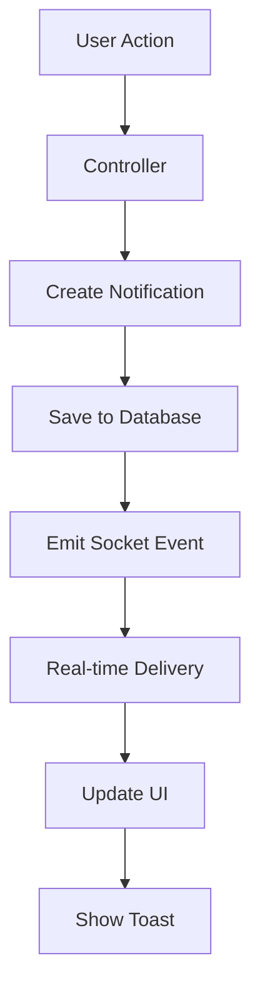

# Notification System Documentation

## Overview

The AdminiX project implements a real-time notification system that handles various types of notifications including project updates, file uploads, task assignments, and user activities. This system uses Socket.IO for real-time delivery and MongoDB for persistent storage.

## 📁 File Structure

```
backend/src/
├── models/
│   └── notification.model.ts          # Notification data model
├── controllers/
│   ├── project.controller.ts          # Project-related notifications
│   ├── task.controller.ts             # Task-related notifications
│   ├── meeting.controller.ts          # Meeting-related notifications
│   └── user.controller.ts             # User-related notifications
├── services/
│   └── notification.service.ts        # Notification business logic
└── socket/
    └── notification.socket.ts         # Socket.IO event handlers

client/src/
├── components/
│   └── ui/
│       ├── notification-listener.tsx  # Real-time notification listener
│       └── notification-panel.tsx     # Notification display component
├── hooks/
│   └── use-notifications.tsx         # Notification state management
└── context/
    └── notification-provider.tsx      # Notification context provider
```

## 🗄️ Database Schema

### Notification Model (`backend/src/models/notification.model.ts`)

```typescript
interface NotificationDocument extends Document {
  userId: mongoose.Types.ObjectId;        // Recipient user
  workspaceId: mongoose.Types.ObjectId;   // Associated workspace
  type: string;                           // Notification type
  message: string;                        // Display message
  read: boolean;                          // Read status
  data?: Record<string, any>;             // Additional data
  createdAt: Date;                        // Creation timestamp
}
```

**Notification Types:**
- `project` - Project-related activities
- `task` - Task assignments and updates
- `meeting` - Meeting schedules and updates
- `file` - File uploads and changes
- `user` - User invitations and role changes
- `system` - System-wide announcements

## 🔧 Backend Implementation

### 1. Notification Creation

#### Project Controller (`backend/src/controllers/project.controller.ts`)

```typescript
// File upload notification
const notification = await Notification.create({
  userId,
  workspaceId,
  type: 'project',
  message: `File '${name}' uploaded to project ${project?.name || ''} by ${user?.name || 'someone'}`,
});

// Send real-time notification
io.to(workspaceId.toString()).emit('notification', notification);
```

#### Task Controller (`backend/src/controllers/task.controller.ts`)

```typescript
// Task assignment notification
if (task.assignee && task.assignee.toString() !== userId.toString()) {
  const notification = await Notification.create({
    userId: task.assignee,
    workspaceId,
    type: 'task',
    message: `Task "${task.title}" assigned to you by ${req.user?.name}`,
    data: { taskId: task._id, projectId: task.projectId }
  });
  
  io.to(task.assignee.toString()).emit('notification', notification);
}
```

#### Meeting Controller (`backend/src/controllers/meeting.controller.ts`)

```typescript
// Meeting schedule notification
const notification = await Notification.create({
  userId,
  workspaceId,
  type: 'meeting',
  message: `Meeting "${title}" scheduled for ${format(new Date(start), "PPpp")}`,
  data: { meetingId: meeting._id, start, end }
});

io.to(workspaceId.toString()).emit('notification', notification);
```

### 2. Notification Service (`backend/src/services/notification.service.ts`)

```typescript
export class NotificationService {
  // Create notification with automatic real-time delivery
  static async createNotification(data: {
    userId: string;
    workspaceId: string;
    type: string;
    message: string;
    data?: Record<string, any>;
  }) {
    const notification = await Notification.create({
      ...data,
      read: false,
      createdAt: new Date()
    });

    // Populate user data
    await notification.populate('userId', 'name profilePicture');

    // Send real-time notification
    io.to(data.workspaceId).emit('notification', notification);

    return notification;
  }

  // Mark notification as read
  static async markAsRead(notificationId: string, userId: string) {
    return await Notification.findOneAndUpdate(
      { _id: notificationId, userId },
      { read: true },
      { new: true }
    );
  }

  // Get user's unread notifications
  static async getUnreadNotifications(userId: string) {
    return await Notification.find({
      userId,
      read: false
    }).populate('userId', 'name profilePicture')
      .sort({ createdAt: -1 });
  }
}
```

### 3. Socket.IO Integration (`backend/src/socket/notification.socket.ts`)

```typescript
import { Server } from 'socket.io';

export const setupNotificationSocket = (io: Server) => {
  io.on('connection', (socket) => {
    // Join workspace room for notifications
    socket.on('join-workspace', (workspaceId: string) => {
      socket.join(workspaceId);
      console.log(`User joined workspace: ${workspaceId}`);
    });

    // Leave workspace room
    socket.on('leave-workspace', (workspaceId: string) => {
      socket.leave(workspaceId);
      console.log(`User left workspace: ${workspaceId}`);
    });

    // Handle notification read status
    socket.on('mark-notification-read', async (notificationId: string) => {
      try {
        await NotificationService.markAsRead(notificationId, socket.userId);
        socket.emit('notification-updated', { notificationId, read: true });
      } catch (error) {
        console.error('Error marking notification as read:', error);
      }
    });
  });
};
```

## 🎨 Frontend Implementation

### 1. Notification Context (`client/src/context/notification-provider.tsx`)

```typescript
interface NotificationContextType {
  notifications: Notification[];
  unreadCount: number;
  markAsRead: (notificationId: string) => void;
  clearAll: () => void;
}

export const NotificationProvider: React.FC<{ children: React.ReactNode }> = ({ children }) => {
  const [notifications, setNotifications] = useState<Notification[]>([]);
  const [unreadCount, setUnreadCount] = useState(0);

  // Fetch notifications on mount
  useEffect(() => {
    fetchNotifications();
  }, []);

  const fetchNotifications = async () => {
    try {
      const response = await axios.get('/api/notifications');
      setNotifications(response.data.notifications);
      setUnreadCount(response.data.notifications.filter(n => !n.read).length);
    } catch (error) {
      console.error('Failed to fetch notifications:', error);
    }
  };

  const markAsRead = async (notificationId: string) => {
    try {
      await axios.patch(`/api/notifications/${notificationId}/read`);
      setNotifications(prev => 
        prev.map(n => n._id === notificationId ? { ...n, read: true } : n)
      );
      setUnreadCount(prev => Math.max(0, prev - 1));
    } catch (error) {
      console.error('Failed to mark notification as read:', error);
    }
  };

  return (
    <NotificationContext.Provider value={{ notifications, unreadCount, markAsRead }}>
      {children}
    </NotificationContext.Provider>
  );
};
```

### 2. Real-time Notification Listener (`client/src/components/ui/notification-listener.tsx`)

```typescript
export const NotificationListener: React.FC = () => {
  const { setNotifications, setUnreadCount } = useNotificationContext();
  const socket = useSocket();

  useEffect(() => {
    if (!socket) return;

    // Listen for new notifications
    socket.on('notification', (notification: Notification) => {
      setNotifications(prev => [notification, ...prev]);
      setUnreadCount(prev => prev + 1);
      
      // Show toast notification
      toast({
        title: notification.type.charAt(0).toUpperCase() + notification.type.slice(1),
        description: notification.message,
        duration: 5000,
      });
    });

    // Listen for notification updates
    socket.on('notification-updated', ({ notificationId, read }) => {
      setNotifications(prev => 
        prev.map(n => n._id === notificationId ? { ...n, read } : n)
      );
    });

    return () => {
      socket.off('notification');
      socket.off('notification-updated');
    };
  }, [socket, setNotifications, setUnreadCount]);

  return null; // This component doesn't render anything
};
```

### 3. Notification Panel Component (`client/src/components/ui/notification-panel.tsx`)

```typescript
export const NotificationPanel: React.FC = () => {
  const { notifications, unreadCount, markAsRead } = useNotificationContext();
  const [isOpen, setIsOpen] = useState(false);

  const handleNotificationClick = (notification: Notification) => {
    if (!notification.read) {
      markAsRead(notification._id);
    }
    
    // Navigate based on notification type
    switch (notification.type) {
      case 'task':
        navigate(`/project/${notification.data?.projectId}/tasks`);
        break;
      case 'meeting':
        navigate(`/project/${notification.data?.projectId}/meetings`);
        break;
      case 'file':
        navigate(`/project/${notification.data?.projectId}/files`);
        break;
    }
    
    setIsOpen(false);
  };

  return (
    <Popover open={isOpen} onOpenChange={setIsOpen}>
      <PopoverTrigger asChild>
        <Button variant="ghost" size="icon" className="relative">
          <Bell className="h-5 w-5" />
          {unreadCount > 0 && (
            <Badge className="absolute -top-1 -right-1 h-5 w-5 rounded-full p-0 text-xs">
              {unreadCount}
            </Badge>
          )}
        </Button>
      </PopoverTrigger>
      
      <PopoverContent className="w-80" align="end">
        <div className="space-y-2">
          <div className="flex items-center justify-between">
            <h4 className="font-semibold">Notifications</h4>
            {unreadCount > 0 && (
              <Button variant="ghost" size="sm" onClick={markAllAsRead}>
                Mark all read
              </Button>
            )}
          </div>
          
          <ScrollArea className="h-80">
            {notifications.length === 0 ? (
              <div className="text-center text-gray-500 py-8">
                No notifications
              </div>
            ) : (
              <div className="space-y-2">
                {notifications.map((notification) => (
                  <NotificationItem
                    key={notification._id}
                    notification={notification}
                    onClick={() => handleNotificationClick(notification)}
                  />
                ))}
              </div>
            )}
          </ScrollArea>
        </div>
      </PopoverContent>
    </Popover>
  );
};
```

### 4. Notification Item Component

```typescript
const NotificationItem: React.FC<{ notification: Notification; onClick: () => void }> = ({ 
  notification, 
  onClick 
}) => {
  const getNotificationIcon = (type: string) => {
    switch (type) {
      case 'task': return <CheckSquare className="h-4 w-4" />;
      case 'meeting': return <Calendar className="h-4 w-4" />;
      case 'file': return <File className="h-4 w-4" />;
      case 'project': return <Folder className="h-4 w-4" />;
      default: return <Bell className="h-4 w-4" />;
    }
  };

  return (
    <div
      className={`p-3 rounded-lg cursor-pointer transition-colors ${
        notification.read 
          ? 'bg-gray-50 hover:bg-gray-100' 
          : 'bg-blue-50 hover:bg-blue-100'
      }`}
      onClick={onClick}
    >
      <div className="flex items-start gap-3">
        <div className="mt-1">
          {getNotificationIcon(notification.type)}
        </div>
        
        <div className="flex-1 min-w-0">
          <p className="text-sm font-medium text-gray-900">
            {notification.message}
          </p>
          <p className="text-xs text-gray-500 mt-1">
            {formatDistanceToNow(new Date(notification.createdAt), { addSuffix: true })}
          </p>
        </div>
        
        {!notification.read && (
          <div className="w-2 h-2 bg-blue-500 rounded-full" />
        )}
      </div>
    </div>
  );
};
```

## 🔄 Notification Flow

### 1. Notification Creation Flow



### 2. Real-time Delivery Process

1. **Backend Event Emission:**
   ```typescript
   io.to(workspaceId.toString()).emit('notification', notification);
   ```

2. **Frontend Event Reception:**
   ```typescript
   socket.on('notification', (notification) => {
     // Update state and show toast
   });
   ```

3. **UI Update:**
   - Add notification to list
   - Increment unread count
   - Show toast notification
   - Update notification badge

## 📊 Notification Statistics

### Types of Notifications Generated:

| Action | Type | Message Format | Recipients |
|--------|------|----------------|------------|
| File Upload | `project` | `File '{name}' uploaded to project {project} by {user}` | Workspace members |
| Task Assignment | `task` | `Task "{title}" assigned to you by {user}` | Assigned user |
| Meeting Schedule | `meeting` | `Meeting "{title}" scheduled for {time}` | Meeting attendees |
| Project Creation | `project` | `Project "{name}" created by {user}` | Workspace members |
| User Invitation | `user` | `You've been invited to join {workspace}` | Invited user |

### Notification Storage:

- **Database:** MongoDB with `Notification` collection
- **Real-time:** Socket.IO for instant delivery
- **Persistence:** All notifications stored permanently
- **Read Status:** Tracked per user
- **Cleanup:** Optional automatic cleanup for old notifications

## 🛠️ Configuration

### Environment Variables:

```env
# Socket.IO Configuration
SOCKET_CORS_ORIGIN=http://localhost:3000
SOCKET_PING_TIMEOUT=60000
SOCKET_PING_INTERVAL=25000

# Notification Settings
NOTIFICATION_RETENTION_DAYS=30
NOTIFICATION_MAX_PER_USER=1000
```

### Socket.IO Setup:

```typescript
// backend/src/index.ts
import { Server } from 'socket.io';

const io = new Server(server, {
  cors: {
    origin: process.env.SOCKET_CORS_ORIGIN,
    methods: ["GET", "POST"]
  },
  pingTimeout: parseInt(process.env.SOCKET_PING_TIMEOUT || '60000'),
  pingInterval: parseInt(process.env.SOCKET_PING_INTERVAL || '25000')
});

setupNotificationSocket(io);
```

## 🧪 Testing Notifications

### Unit Tests:

```typescript
describe('NotificationService', () => {
  test('creates notification with correct data', async () => {
    const notification = await NotificationService.createNotification({
      userId: 'user123',
      workspaceId: 'workspace123',
      type: 'task',
      message: 'Task assigned to you'
    });

    expect(notification.type).toBe('task');
    expect(notification.read).toBe(false);
  });
});
```

### Integration Tests:

```typescript
describe('Notification Integration', () => {
  test('sends real-time notification on file upload', async () => {
    // Mock socket emission
    const mockEmit = jest.fn();
    io.to = jest.fn().mockReturnValue({ emit: mockEmit });

    // Upload file
    await uploadFile(fileData);

    // Verify notification was created and emitted
    expect(mockEmit).toHaveBeenCalledWith('notification', expect.any(Object));
  });
});
```

## 🔧 Maintenance

### Cleanup Old Notifications:

```typescript
// Scheduled job to clean old notifications
export const cleanupOldNotifications = async () => {
  const retentionDays = parseInt(process.env.NOTIFICATION_RETENTION_DAYS || '30');
  const cutoffDate = new Date();
  cutoffDate.setDate(cutoffDate.getDate() - retentionDays);

  await Notification.deleteMany({
    createdAt: { $lt: cutoffDate },
    read: true
  });
};
```

### Notification Analytics:

```typescript
// Get notification statistics
export const getNotificationStats = async (workspaceId: string) => {
  const stats = await Notification.aggregate([
    { $match: { workspaceId: new ObjectId(workspaceId) } },
    { $group: {
      _id: '$type',
      count: { $sum: 1 },
      unread: { $sum: { $cond: ['$read', 0, 1] } }
    }}
  ]);
  
  return stats;
};
```

This notification system provides a comprehensive solution for real-time user engagement with persistent storage and clean UI integration.
