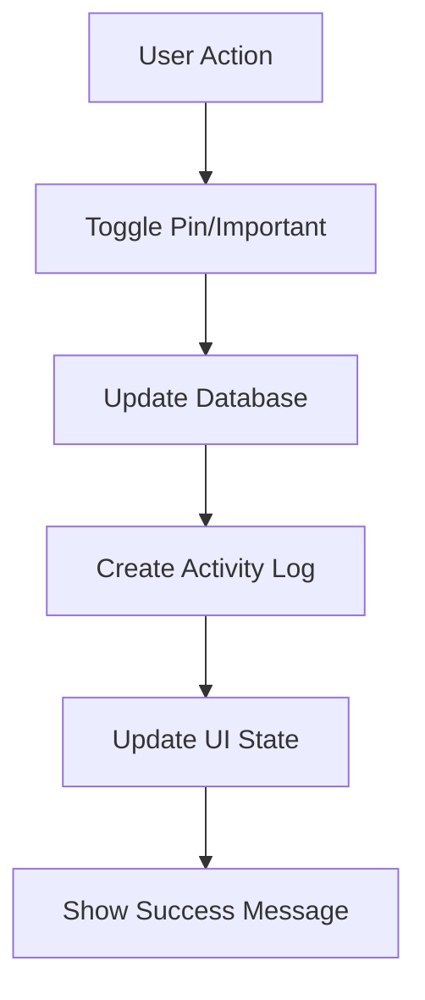

# Pinned/Important System Documentation

## Overview

The AdminiX project implements a comprehensive pinned/important system that allows users to mark activities, tasks, and other items as important for quick access and priority management. This system provides visual indicators, filtering capabilities, and enhanced organization features.

## 📁 File Structure

```
backend/src/
├── models/
│   ├── activity.model.ts                # Activity model with pinned field
│   ├── task.model.ts                    # Task model with important field
│   └── notification.model.ts            # Notification model with pinned field
├── controllers/
│   ├── activity.controller.ts           # Activity pin/unpin operations
│   ├── task.controller.ts               # Task important marking
│   └── notification.controller.ts       # Notification pin operations
└── services/
    └── pinned.service.ts                # Pinned items business logic

client/src/
├── components/workspace/
│   ├── ProjectDetails.tsx               # Activity log with pin functionality
│   └── Tasks.tsx                       # Task list with important marking
├── components/ui/
│   ├── pin-button.tsx                   # Reusable pin button component
│   └── important-badge.tsx              # Important item badge
└── hooks/
    └── use-pinned-items.tsx             # Pinned items state management
```

## 🗄️ Database Schema

### Activity Model with Pinned Field (`backend/src/models/activity.model.ts`)

```typescript
interface ActivityDocument extends Document {
  projectId: mongoose.Types.ObjectId;    // Associated project
  userId: mongoose.Types.ObjectId;       // User who performed the action
  type: string;                          // Activity type
  message: string;                       // Formatted activity message
  meta?: Record<string, any>;            // Additional metadata
  pinned: boolean;                       // Pinned status
  pinnedBy?: mongoose.Types.ObjectId;    // User who pinned the activity
  pinnedAt?: Date;                       // When the activity was pinned
  createdAt: Date;                       // Creation timestamp
}
```

### Task Model with Important Field (`backend/src/models/task.model.ts`)

```typescript
interface TaskDocument extends Document {
  title: string;                         // Task title
  description?: string;                  // Task description
  projectId: mongoose.Types.ObjectId;    // Associated project
  assignee?: mongoose.Types.ObjectId;    // Task assignee
  status: string;                        // Task status
  priority: string;                      // Task priority
  important: boolean;                    // Important status
  markedImportantBy?: mongoose.Types.ObjectId; // User who marked as important
  markedImportantAt?: Date;              // When marked as important
  createdAt: Date;                       // Creation timestamp
  updatedAt: Date;                       // Last update timestamp
}
```

## 🔧 Backend Implementation

### 1. Activity Pin Controller (`backend/src/controllers/activity.controller.ts`)

```typescript
// Pin/unpin activity
export const toggleActivityPin = asyncHandler(async (req: Request, res: Response) => {
  const { activityId } = req.params;
  const { pinned } = req.body;

  const activity = await Activity.findByIdAndUpdate(
    activityId,
    {
      pinned,
      pinnedBy: pinned ? req.user?._id : undefined,
      pinnedAt: pinned ? new Date() : undefined
    },
    { new: true }
  ).populate('userId', 'name profilePicture');

  if (!activity) {
    throw new AppError('Activity not found', 404);
  }

  // Create activity log for pin/unpin action
  await Activity.create({
    userId: req.user?._id,
    projectId: activity.projectId,
    type: pinned ? 'activity_pin' : 'activity_unpin',
    message: `${pinned ? '📌' : '📌'} Activity ${pinned ? 'Pinned' : 'Unpinned'}\n📋 ${activity.message.substring(0, 50)}...\n📅 ${format(new Date(), "PPpp")}\n👤 ${pinned ? 'Pinned' : 'Unpinned'} by ${req.user?.name || 'User'}`,
  });

  res.json({ success: true, data: activity });
});

// Get pinned activities for project
export const getPinnedActivities = asyncHandler(async (req: Request, res: Response) => {
  const { projectId } = req.params;

  const pinnedActivities = await Activity.find({ projectId, pinned: true })
    .populate('userId', 'name profilePicture')
    .populate('pinnedBy', 'name profilePicture')
    .sort({ pinnedAt: -1 });

  res.json({ success: true, data: pinnedActivities });
});
```

### 2. Task Important Controller (`backend/src/controllers/task.controller.ts`)

```typescript
// Mark/unmark task as important
export const toggleTaskImportant = asyncHandler(async (req: Request, res: Response) => {
  const { taskId } = req.params;
  const { important } = req.body;

  const task = await Task.findByIdAndUpdate(
    taskId,
    {
      important,
      markedImportantBy: important ? req.user?._id : undefined,
      markedImportantAt: important ? new Date() : undefined
    },
    { new: true }
  ).populate('assignee', 'name profilePicture');

  if (!task) {
    throw new AppError('Task not found', 404);
  }

  // Create activity log for important marking
  await Activity.create({
    userId: req.user?._id,
    projectId: task.projectId,
    type: important ? 'task_important' : 'task_unimportant',
    message: `${important ? '⭐' : '⭐'} Task ${important ? 'Marked Important' : 'Unmarked Important'}\n📋 ${task.title}\n📅 ${format(new Date(), "PPpp")}\n👤 ${important ? 'Marked' : 'Unmarked'} by ${req.user?.name || 'User'}`,
  });

  res.json({ success: true, data: task });
});

// Get important tasks for project
export const getImportantTasks = asyncHandler(async (req: Request, res: Response) => {
  const { projectId } = req.params;

  const importantTasks = await Task.find({ projectId, important: true })
    .populate('assignee', 'name profilePicture')
    .populate('markedImportantBy', 'name profilePicture')
    .sort({ markedImportantAt: -1 });

  res.json({ success: true, data: importantTasks });
});
```

### 3. Pinned Service (`backend/src/services/pinned.service.ts`)

```typescript
export class PinnedService {
  // Get all pinned items for a project
  static async getPinnedItems(projectId: string) {
    const [pinnedActivities, importantTasks] = await Promise.all([
      Activity.find({ projectId, pinned: true })
        .populate('userId', 'name profilePicture')
        .populate('pinnedBy', 'name profilePicture')
        .sort({ pinnedAt: -1 }),
      Task.find({ projectId, important: true })
        .populate('assignee', 'name profilePicture')
        .populate('markedImportantBy', 'name profilePicture')
        .sort({ markedImportantAt: -1 })
    ]);

    return {
      activities: pinnedActivities,
      tasks: importantTasks,
      total: pinnedActivities.length + importantTasks.length
    };
  }

  // Get pinned items count
  static async getPinnedCount(projectId: string) {
    const [activityCount, taskCount] = await Promise.all([
      Activity.countDocuments({ projectId, pinned: true }),
      Task.countDocuments({ projectId, important: true })
    ]);

    return {
      activities: activityCount,
      tasks: taskCount,
      total: activityCount + taskCount
    };
  }

  // Bulk pin/unpin activities
  static async bulkToggleActivityPin(activityIds: string[], pinned: boolean, userId: string) {
    const activities = await Activity.find({ _id: { $in: activityIds } });
    
    const updatePromises = activities.map(activity => 
      Activity.findByIdAndUpdate(activity._id, {
        pinned,
        pinnedBy: pinned ? userId : undefined,
        pinnedAt: pinned ? new Date() : undefined
      })
    );

    await Promise.all(updatePromises);

    return {
      success: true,
      message: `${pinned ? 'Pinned' : 'Unpinned'} ${activities.length} activities`
    };
  }

  // Bulk mark/unmark tasks as important
  static async bulkToggleTaskImportant(taskIds: string[], important: boolean, userId: string) {
    const tasks = await Task.find({ _id: { $in: taskIds } });
    
    const updatePromises = tasks.map(task => 
      Task.findByIdAndUpdate(task._id, {
        important,
        markedImportantBy: important ? userId : undefined,
        markedImportantAt: important ? new Date() : undefined
      })
    );

    await Promise.all(updatePromises);

    return {
      success: true,
      message: `${important ? 'Marked' : 'Unmarked'} ${tasks.length} tasks as important`
    };
  }

  // Get user's pinned items across all projects
  static async getUserPinnedItems(userId: string) {
    const [userActivities, userTasks] = await Promise.all([
      Activity.find({ userId, pinned: true })
        .populate('projectId', 'name')
        .sort({ pinnedAt: -1 }),
      Task.find({ assignee: userId, important: true })
        .populate('projectId', 'name')
        .sort({ markedImportantAt: -1 })
    ]);

    return {
      activities: userActivities,
      tasks: userTasks,
      total: userActivities.length + userTasks.length
    };
  }
}
```

## 🎨 Frontend Implementation

### 1. Pin Button Component (`client/src/components/ui/pin-button.tsx`)

```typescript
interface PinButtonProps {
  isPinned: boolean;
  onToggle: () => void;
  size?: 'sm' | 'md' | 'lg';
  className?: string;
  tooltip?: string;
}

export const PinButton: React.FC<PinButtonProps> = ({ 
  isPinned, 
  onToggle, 
  size = 'md',
  className = '',
  tooltip
}) => {
  const sizeClasses = {
    sm: 'h-4 w-4',
    md: 'h-5 w-5',
    lg: 'h-6 w-6'
  };

  return (
    <Tooltip content={tooltip || (isPinned ? 'Unpin' : 'Pin')}>
      <Button
        variant="ghost"
        size="sm"
        onClick={onToggle}
        className={`p-1 hover:bg-gray-100 ${className}`}
      >
        {isPinned ? (
          <Pin className={`${sizeClasses[size]} text-yellow-500 fill-current`} />
        ) : (
          <Pin className={`${sizeClasses[size]} text-gray-400 hover:text-yellow-500`} />
        )}
      </Button>
    </Tooltip>
  );
};
```

### 2. Important Badge Component (`client/src/components/ui/important-badge.tsx`)

```typescript
interface ImportantBadgeProps {
  isImportant: boolean;
  onToggle?: () => void;
  showToggle?: boolean;
  className?: string;
}

export const ImportantBadge: React.FC<ImportantBadgeProps> = ({ 
  isImportant, 
  onToggle, 
  showToggle = false,
  className = ''
}) => {
  if (!isImportant && !showToggle) return null;

  return (
    <div className={`flex items-center gap-1 ${className}`}>
      {isImportant && (
        <Badge variant="secondary" className="bg-yellow-100 text-yellow-800 border-yellow-200">
          <Star className="h-3 w-3 mr-1 fill-current" />
          Important
        </Badge>
      )}
      {showToggle && (
        <Button
          variant="ghost"
          size="sm"
          onClick={onToggle}
          className="p-1 h-6 w-6"
        >
          {isImportant ? (
            <Star className="h-4 w-4 text-yellow-500 fill-current" />
          ) : (
            <Star className="h-4 w-4 text-gray-400 hover:text-yellow-500" />
          )}
        </Button>
      )}
    </div>
  );
};
```

### 3. Activity Log with Pin Functionality (`client/src/page/workspace/ProjectDetails.tsx`)

```typescript
function ActivityLogTab({ onPinChange }: { onPinChange?: () => void }) {
  const [activities, setActivities] = useState<any[]>([]);
  const [pinnedActivities, setPinnedActivities] = useState<any[]>([]);
  const [showPinnedOnly, setShowPinnedOnly] = useState(false);

  // Fetch activities and pinned activities
  useEffect(() => {
    if (!projectId) return;
    
    const fetchActivities = async () => {
      try {
        const [activitiesRes, pinnedRes] = await Promise.all([
          axios.get(`/api/project/${projectId}/activities`),
          axios.get(`/api/project/${projectId}/pinned-activities`)
        ]);
        
        setActivities(activitiesRes.data.activities);
        setPinnedActivities(pinnedRes.data.data);
      } catch (error) {
        console.error('Failed to fetch activities:', error);
      }
    };

    fetchActivities();
  }, [projectId]);

  const handlePinToggle = async (activityId: string, currentPinned: boolean) => {
    try {
      const response = await axios.patch(`/api/activity/${activityId}/pin`, {
        pinned: !currentPinned
      });

      // Update activities list
      setActivities(prev => 
        prev.map(activity => 
          activity._id === activityId 
            ? { ...activity, pinned: !currentPinned }
            : activity
        )
      );

      // Update pinned activities list
      if (!currentPinned) {
        setPinnedActivities(prev => [response.data.data, ...prev]);
      } else {
        setPinnedActivities(prev => prev.filter(a => a._id !== activityId));
      }

      onPinChange?.();
      toast.success(`Activity ${!currentPinned ? 'pinned' : 'unpinned'} successfully`);
    } catch (error) {
      toast.error('Failed to update pin status');
    }
  };

  const filteredActivities = showPinnedOnly 
    ? activities.filter(a => a.pinned)
    : activities;

  return (
    <div className="py-4 w-full">
      {/* Filter Controls */}
      <div className="flex items-center gap-4 mb-6">
        <div className="flex items-center gap-2">
          <Switch
            checked={showPinnedOnly}
            onCheckedChange={setShowPinnedOnly}
          />
          <Label>Show pinned only</Label>
        </div>
        
        {pinnedActivities.length > 0 && (
          <Badge variant="secondary" className="bg-yellow-100 text-yellow-800">
            <Pin className="h-3 w-3 mr-1" />
            {pinnedActivities.length} pinned
          </Badge>
        )}
      </div>

      {/* Activity Timeline */}
      <div className="relative">
        <div className="absolute left-4 top-0 bottom-0 w-0.5 bg-gray-200" />
        <div className="space-y-8 pl-10">
          {grouped[day].map((a: any) => (
            <div key={a._id} className="relative flex gap-3 items-start bg-white rounded-xl border p-4 shadow-sm">
              <div className="absolute left-[-2.1rem] top-6 z-10">
                {getActivityIcon(a.type)}
              </div>
              <div className="flex-1">
                <div className="flex items-center gap-2 mb-1">
                  <Avatar className="w-7 h-7">
                    <AvatarImage src={a.userId?.profilePicture} alt={a.userId?.name} />
                    <AvatarFallback>{a.userId?.name?.[0]}</AvatarFallback>
                  </Avatar>
                  <span className="font-medium text-sm">{a.userId?.name}</span>
                  <span className="text-xs text-gray-400">
                    {formatDistanceToNow(new Date(a.createdAt), { addSuffix: true })}
                  </span>
                  
                  {/* Pin Button */}
                  <PinButton
                    isPinned={a.pinned}
                    onToggle={() => handlePinToggle(a._id, a.pinned)}
                    tooltip={a.pinned ? 'Unpin activity' : 'Pin activity'}
                  />
                </div>
                <div className={`text-gray-800 text-sm whitespace-pre-line ${getActivityClass(a.type)}`}>
                  {formatMeetingTime(a.message)}
                </div>
              </div>
            </div>
          ))}
        </div>
      </div>
    </div>
  );
}
```

### 4. Task List with Important Marking (`client/src/page/workspace/Tasks.tsx`)

```typescript
export const Tasks: React.FC = () => {
  const [tasks, setTasks] = useState<Task[]>([]);
  const [importantTasks, setImportantTasks] = useState<Task[]>([]);
  const [showImportantOnly, setShowImportantOnly] = useState(false);

  // Fetch tasks and important tasks
  useEffect(() => {
    if (!projectId) return;
    
    const fetchTasks = async () => {
      try {
        const [tasksRes, importantRes] = await Promise.all([
          axios.get(`/api/project/${projectId}/tasks`),
          axios.get(`/api/project/${projectId}/important-tasks`)
        ]);
        
        setTasks(tasksRes.data.tasks);
        setImportantTasks(importantRes.data.data);
      } catch (error) {
        console.error('Failed to fetch tasks:', error);
      }
    };

    fetchTasks();
  }, [projectId]);

  const handleImportantToggle = async (taskId: string, currentImportant: boolean) => {
    try {
      const response = await axios.patch(`/api/task/${taskId}/important`, {
        important: !currentImportant
      });

      // Update tasks list
      setTasks(prev => 
        prev.map(task => 
          task._id === taskId 
            ? { ...task, important: !currentImportant }
            : task
        )
      );

      // Update important tasks list
      if (!currentImportant) {
        setImportantTasks(prev => [response.data.data, ...prev]);
      } else {
        setImportantTasks(prev => prev.filter(t => t._id !== taskId));
      }

      toast.success(`Task ${!currentImportant ? 'marked as important' : 'unmarked as important'}`);
    } catch (error) {
      toast.error('Failed to update important status');
    }
  };

  const filteredTasks = showImportantOnly 
    ? tasks.filter(t => t.important)
    : tasks;

  return (
    <div className="space-y-6">
      {/* Filter Controls */}
      <div className="flex items-center justify-between">
        <div className="flex items-center gap-4">
          <div className="flex items-center gap-2">
            <Switch
              checked={showImportantOnly}
              onCheckedChange={setShowImportantOnly}
            />
            <Label>Show important only</Label>
          </div>
          
          {importantTasks.length > 0 && (
            <Badge variant="secondary" className="bg-yellow-100 text-yellow-800">
              <Star className="h-3 w-3 mr-1 fill-current" />
              {importantTasks.length} important
            </Badge>
          )}
        </div>
        
        <CreateTaskDialog onCreateTask={handleCreateTask} />
      </div>

      {/* Task List */}
      <div className="space-y-4">
        {filteredTasks.map((task) => (
          <TaskCard
            key={task._id}
            task={task}
            onUpdate={handleUpdateTask}
            onDelete={handleDeleteTask}
            onImportantToggle={handleImportantToggle}
          />
        ))}
      </div>
    </div>
  );
};
```

### 5. Task Card with Important Badge

```typescript
const TaskCard: React.FC<{ 
  task: Task; 
  onUpdate: (id: string, data: any) => void; 
  onDelete: (id: string) => void;
  onImportantToggle: (id: string, important: boolean) => void;
}> = ({ task, onUpdate, onDelete, onImportantToggle }) => {
  return (
    <div className="bg-white rounded-lg border p-6 hover:shadow-md transition-shadow">
      <div className="flex items-start justify-between mb-4">
        <div className="flex-1">
          <div className="flex items-center gap-2 mb-2">
            <h3 className="font-semibold text-lg">{task.title}</h3>
            <ImportantBadge
              isImportant={task.important}
              onToggle={() => onImportantToggle(task._id, task.important)}
              showToggle={true}
            />
          </div>
          <p className="text-sm text-gray-600">{task.description}</p>
        </div>
        
        <DropdownMenu>
          <DropdownMenuTrigger asChild>
            <Button variant="ghost" size="sm">
              <MoreVertical className="h-4 w-4" />
            </Button>
          </DropdownMenuTrigger>
          <DropdownMenuContent>
            <DropdownMenuItem onClick={() => onUpdate(task._id, {})}>
              <Edit className="h-4 w-4 mr-2" />
              Edit Task
            </DropdownMenuItem>
            <DropdownMenuItem onClick={() => onDelete(task._id)} className="text-red-600">
              <Trash className="h-4 w-4 mr-2" />
              Delete Task
            </DropdownMenuItem>
          </DropdownMenuContent>
        </DropdownMenu>
      </div>

      <div className="space-y-3">
        <div className="flex items-center justify-between text-sm">
          <span className="text-gray-600">Status</span>
          <Badge className={getStatusColor(task.status)}>
            {task.status}
          </Badge>
        </div>

        <div className="flex items-center justify-between text-sm">
          <span className="text-gray-600">Priority</span>
          <Badge className={getPriorityColor(task.priority)}>
            {task.priority}
          </Badge>
        </div>

        {task.assignee && (
          <div className="flex items-center justify-between text-sm">
            <span className="text-gray-600">Assignee</span>
            <div className="flex items-center gap-2">
              <Avatar className="w-6 h-6">
                <AvatarImage src={task.assignee.profilePicture} alt={task.assignee.name} />
                <AvatarFallback>{task.assignee.name[0]}</AvatarFallback>
              </Avatar>
              <span>{task.assignee.name}</span>
            </div>
          </div>
        )}
      </div>
    </div>
  );
};
```

## 📊 Pinned/Important Analytics

### Usage Statistics

```typescript
// Calculate pinned/important metrics
const calculatePinnedMetrics = (activities: Activity[], tasks: Task[]) => {
  const pinnedActivities = activities.filter(a => a.pinned).length;
  const importantTasks = tasks.filter(t => t.important).length;
  const totalItems = activities.length + tasks.length;
  const pinnedItems = pinnedActivities + importantTasks;

  return {
    totalItems,
    pinnedItems,
    pinnedActivities,
    importantTasks,
    pinRate: totalItems > 0 ? (pinnedItems / totalItems) * 100 : 0
  };
};
```

### User Pin Patterns

```typescript
// Analyze user pin patterns
const analyzePinPatterns = (pinnedItems: any[]) => {
  const userPinCounts: Record<string, number> = {};
  const typePinCounts: Record<string, number> = {};
  
  pinnedItems.forEach(item => {
    // Count pins by user
    const pinnedBy = item.pinnedBy?.name || item.markedImportantBy?.name || 'Unknown';
    userPinCounts[pinnedBy] = (userPinCounts[pinnedBy] || 0) + 1;
    
    // Count pins by type
    const type = item.type || 'task';
    typePinCounts[type] = (typePinCounts[type] || 0) + 1;
  });

  return {
    userPinCounts,
    typePinCounts,
    topPinners: Object.entries(userPinCounts)
      .sort(([,a], [,b]) => b - a)
      .slice(0, 5)
  };
};
```

## 🔄 Pin/Important Workflow

### 1. Pin/Important Process



### 2. Pin/Important States

| State | Description | Visual Indicator | Actions Available |
|-------|-------------|------------------|------------------|
| `pinned` | Activity is pinned | Yellow pin icon | Unpin, view details |
| `important` | Task is marked important | Yellow star badge | Unmark, edit task |
| `normal` | Regular item | No special indicator | Pin/mark important |

## 🛠️ Configuration

### Environment Variables

```env
# Pinned/Important Settings
PINNED_MAX_PER_PROJECT=50
PINNED_MAX_PER_USER=100
IMPORTANT_MAX_PER_PROJECT=100
PINNED_RETENTION_DAYS=365
```

### Database Indexes

```typescript
// backend/src/models/activity.model.ts
ActivitySchema.index({ projectId: 1, pinned: 1 });
ActivitySchema.index({ pinnedBy: 1, pinnedAt: -1 });

// backend/src/models/task.model.ts
TaskSchema.index({ projectId: 1, important: 1 });
TaskSchema.index({ markedImportantBy: 1, markedImportantAt: -1 });
```

## 🧪 Testing Pinned/Important

### Unit Tests

```typescript
describe('PinnedService', () => {
  test('toggles activity pin status', async () => {
    const activity = await Activity.create({
      projectId: 'project123',
      userId: 'user123',
      type: 'task_create',
      message: 'Test activity',
      pinned: false
    });

    const updatedActivity = await PinnedService.toggleActivityPin(activity._id, true, 'user123');
    expect(updatedActivity.pinned).toBe(true);
    expect(updatedActivity.pinnedBy).toBe('user123');
  });

  test('gets pinned items count', async () => {
    const count = await PinnedService.getPinnedCount('project123');
    expect(count).toHaveProperty('activities');
    expect(count).toHaveProperty('tasks');
    expect(count).toHaveProperty('total');
  });
});
```

### Integration Tests

```typescript
describe('Pinned Integration', () => {
  test('pins activity and updates UI', async () => {
    const response = await request(app)
      .patch(`/api/activity/${activityId}/pin`)
      .send({ pinned: true })
      .set('Authorization', `Bearer ${token}`);

    expect(response.status).toBe(200);
    expect(response.body.data.pinned).toBe(true);

    // Verify activity log was created
    const activities = await Activity.find({ type: 'activity_pin' });
    expect(activities).toHaveLength(1);
  });
});
```

## 🔧 Maintenance

### Pin Cleanup

```typescript
// Clean up old pinned items
export const cleanupOldPinnedItems = async () => {
  const cutoffDate = subMonths(new Date(), 12);
  
  await Activity.updateMany(
    {
      pinned: true,
      pinnedAt: { $lt: cutoffDate }
    },
    { pinned: false, pinnedBy: undefined, pinnedAt: undefined }
  );
};
```

### Pin Analytics

```typescript
// Get pin performance metrics
export const getPinAnalytics = async (projectId: string) => {
  const analytics = await Activity.aggregate([
    { $match: { projectId: new ObjectId(projectId) } },
    { $group: {
      _id: '$type',
      total: { $sum: 1 },
      pinned: { $sum: { $cond: ['$pinned', 1, 0] } },
      pinRate: { $avg: { $cond: ['$pinned', 1, 0] } }
    }}
  ]);
  
  return analytics;
};
```

This pinned/important system provides comprehensive organization features with visual indicators, filtering capabilities, and detailed analytics tracking.
