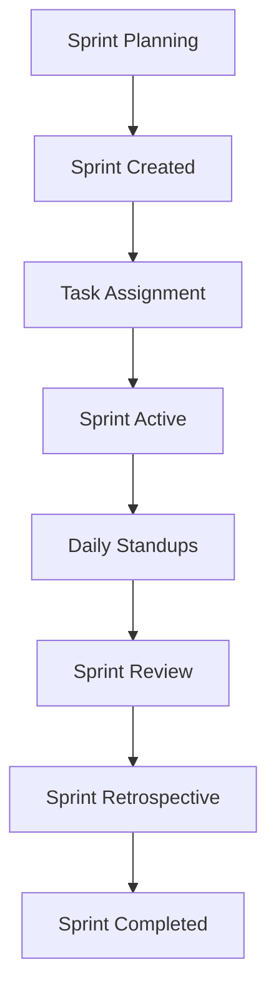

# Sprint System Documentation

## Overview

The AdminiX project implements a comprehensive sprint management system for agile project development. This system handles sprint creation, task assignment, progress tracking, and AI-powered sprint planning with detailed activity logging.

## 📁 File Structure

```
backend/src/
├── models/
│   └── sprint.model.ts                # Sprint data model
├── controllers/
│   └── sprint.controller.ts           # Sprint CRUD operations
├── services/
│   └── sprint.service.ts              # Sprint business logic
└── validation/
    └── sprint.validation.ts           # Sprint data validation

client/src/
├── components/workspace/sprint/
│   ├── sprint-management.tsx          # Main sprint management component
│   ├── create-sprint-form.tsx         # Sprint creation form
│   ├── edit-sprint-form.tsx           # Sprint editing form
│   ├── delete-sprint-dialog.tsx       # Sprint deletion dialog
│   ├── sprint-tasks-dialog.tsx        # Task assignment dialog
│   └── ai-sprint-planning.tsx         # AI sprint planning component
└── hooks/
    └── use-get-sprints.tsx            # Sprint data fetching
```

## 🗄️ Database Schema

### Sprint Model (`backend/src/models/sprint.model.ts`)

```typescript
interface SprintDocument extends Document {
  name: string;                          // Sprint name
  projectId: mongoose.Types.ObjectId;    // Associated project
  startDate: Date;                       // Sprint start date
  endDate: Date;                         // Sprint end date
  status: 'planning' | 'active' | 'completed' | 'cancelled';
  goal: string;                          // Sprint goal/objective
  tasks: mongoose.Types.ObjectId[];      // Assigned tasks
  velocity: number;                      // Estimated velocity
  actualVelocity: number;                // Actual completed points
  createdAt: Date;                       // Creation timestamp
  updatedAt: Date;                       // Last update timestamp
}
```

## 🔧 Backend Implementation

### 1. Sprint Controller (`backend/src/controllers/sprint.controller.ts`)

```typescript
// Sprint creation with activity logging
export const createSprint = asyncHandler(async (req: Request, res: Response) => {
  const { name, startDate, endDate, goal, velocity } = req.body;
  const { projectId } = req.params;

  const sprint = await Sprint.create({
    name,
    projectId,
    startDate,
    endDate,
    goal,
    velocity,
    status: 'planning'
  });

  // Create activity log
  await Activity.create({
    userId: req.user?._id,
    projectId,
    type: 'sprint_create',
    message: `🚀 Sprint Created\n📋 ${sprint.name}\n📅 ${format(new Date(), "PPpp")}\n👤 Created by ${req.user?.name || 'User'}`,
  });

  res.status(201).json({ success: true, data: sprint });
});

// Sprint update with change tracking
export const updateSprint = asyncHandler(async (req: Request, res: Response) => {
  const { sprintId } = req.params;
  const updates = req.body;

  const oldSprint = await Sprint.findById(sprintId);
  const sprint = await Sprint.findByIdAndUpdate(sprintId, updates, { new: true });

  // Create activity log
  await Activity.create({
    userId: req.user?._id,
    projectId: sprint.projectId,
    type: 'sprint_update',
    message: `🔄 Sprint Updated\n📋 ${sprint.name}\n📅 ${format(new Date(), "PPpp")}\n👤 Updated by ${req.user?.name || 'User'}`,
  });

  res.json({ success: true, data: sprint });
});

// Sprint deletion with task cleanup
export const deleteSprint = asyncHandler(async (req: Request, res: Response) => {
  const { sprintId } = req.params;

  const sprint = await Sprint.findById(sprintId);
  
  // Remove sprint from all associated tasks
  await Task.updateMany(
    { sprintId },
    { $unset: { sprintId: 1 } }
  );

  await Sprint.findByIdAndDelete(sprintId);

  // Create activity log
  await Activity.create({
    userId: req.user?._id,
    projectId: sprint.projectId,
    type: 'sprint_delete',
    message: `🗑️ Sprint Deleted\n📅 ${format(new Date(), "PPpp")}\n👤 Deleted by ${req.user?.name || 'User'}\n⚠️ All associated tasks were also deleted`,
  });

  res.json({ success: true, message: 'Sprint deleted successfully' });
});
```

### 2. Sprint Service (`backend/src/services/sprint.service.ts`)

```typescript
export class SprintService {
  // Create sprint with validation
  static async createSprint(data: {
    name: string;
    projectId: string;
    startDate: Date;
    endDate: Date;
    goal: string;
    velocity: number;
  }) {
    // Validate date range
    if (new Date(data.startDate) >= new Date(data.endDate)) {
      throw new AppError('End date must be after start date', 400);
    }

    // Check for overlapping sprints
    const overlappingSprint = await Sprint.findOne({
      projectId: data.projectId,
      $or: [
        {
          startDate: { $lte: data.endDate },
          endDate: { $gte: data.startDate }
        }
      ]
    });

    if (overlappingSprint) {
      throw new AppError('Sprint dates overlap with existing sprint', 400);
    }

    return await Sprint.create({
      ...data,
      status: 'planning',
      tasks: []
    });
  }

  // Get sprints with task details
  static async getSprintsByProject(projectId: string) {
    return await Sprint.find({ projectId })
      .populate({
        path: 'tasks',
        select: 'title status priority assignee',
        populate: { path: 'assignee', select: 'name profilePicture' }
      })
      .sort({ startDate: -1 });
  }

  // Calculate sprint metrics
  static async getSprintMetrics(sprintId: string) {
    const sprint = await Sprint.findById(sprintId)
      .populate('tasks');

    const totalTasks = sprint.tasks.length;
    const completedTasks = sprint.tasks.filter(task => task.status === 'completed').length;
    const inProgressTasks = sprint.tasks.filter(task => task.status === 'in-progress').length;
    const pendingTasks = sprint.tasks.filter(task => task.status === 'to-do').length;

    const completionRate = totalTasks > 0 ? (completedTasks / totalTasks) * 100 : 0;

    return {
      totalTasks,
      completedTasks,
      inProgressTasks,
      pendingTasks,
      completionRate,
      velocity: sprint.velocity,
      actualVelocity: sprint.actualVelocity
    };
  }

  // Assign tasks to sprint
  static async assignTasksToSprint(sprintId: string, taskIds: string[]) {
    // Remove tasks from other sprints
    await Task.updateMany(
      { _id: { $in: taskIds } },
      { $unset: { sprintId: 1 } }
    );

    // Assign tasks to this sprint
    await Task.updateMany(
      { _id: { $in: taskIds } },
      { sprintId }
    );

    // Update sprint tasks array
    await Sprint.findByIdAndUpdate(sprintId, {
      $addToSet: { tasks: { $each: taskIds } }
    });

    return await Sprint.findById(sprintId).populate('tasks');
  }
}
```

### 3. Sprint Validation (`backend/src/validation/sprint.validation.ts`)

```typescript
import Joi from 'joi';

export const createSprintSchema = Joi.object({
  name: Joi.string().required().min(3).max(100),
  startDate: Joi.date().required(),
  endDate: Joi.date().required().greater(Joi.ref('startDate')),
  goal: Joi.string().required().min(10).max(500),
  velocity: Joi.number().integer().min(1).max(1000).default(0)
});

export const updateSprintSchema = Joi.object({
  name: Joi.string().min(3).max(100),
  startDate: Joi.date(),
  endDate: Joi.date(),
  goal: Joi.string().min(10).max(500),
  velocity: Joi.number().integer().min(1).max(1000),
  status: Joi.string().valid('planning', 'active', 'completed', 'cancelled')
});
```

## 🎨 Frontend Implementation

### 1. Sprint Management Component (`client/src/components/workspace/sprint/sprint-management.tsx`)

```typescript
export const SprintManagement: React.FC = () => {
  const [sprints, setSprints] = useState<Sprint[]>([]);
  const [loading, setLoading] = useState(false);
  const [selectedSprint, setSelectedSprint] = useState<Sprint | null>(null);

  // Fetch sprints
  const { data: sprintsData, refetch } = useGetSprints(projectId);

  useEffect(() => {
    if (sprintsData) {
      setSprints(sprintsData);
    }
  }, [sprintsData]);

  const handleCreateSprint = async (sprintData: CreateSprintData) => {
    try {
      await axios.post(`/api/project/${projectId}/sprints`, sprintData);
      refetch();
      toast.success('Sprint created successfully');
    } catch (error) {
      toast.error('Failed to create sprint');
    }
  };

  const handleUpdateSprint = async (sprintId: string, updates: Partial<Sprint>) => {
    try {
      await axios.patch(`/api/sprint/${sprintId}`, updates);
      refetch();
      toast.success('Sprint updated successfully');
    } catch (error) {
      toast.error('Failed to update sprint');
    }
  };

  const handleDeleteSprint = async (sprintId: string) => {
    try {
      await axios.delete(`/api/sprint/${sprintId}`);
      refetch();
      toast.success('Sprint deleted successfully');
    } catch (error) {
      toast.error('Failed to delete sprint');
    }
  };

  return (
    <div className="space-y-6">
      {/* Sprint Header */}
      <div className="flex items-center justify-between">
        <div>
          <h2 className="text-2xl font-bold">Sprint Management</h2>
          <p className="text-gray-600">Manage your project sprints and track progress</p>
        </div>
        <CreateSprintDialog onCreateSprint={handleCreateSprint} />
      </div>

      {/* Sprint List */}
      <div className="grid gap-4 md:grid-cols-2 lg:grid-cols-3">
        {sprints.map((sprint) => (
          <SprintCard
            key={sprint._id}
            sprint={sprint}
            onEdit={handleUpdateSprint}
            onDelete={handleDeleteSprint}
            onSelect={setSelectedSprint}
          />
        ))}
      </div>

      {/* Sprint Details Modal */}
      {selectedSprint && (
        <SprintDetailsDialog
          sprint={selectedSprint}
          onClose={() => setSelectedSprint(null)}
          onUpdate={handleUpdateSprint}
        />
      )}
    </div>
  );
};
```

### 2. Sprint Card Component

```typescript
const SprintCard: React.FC<{ sprint: Sprint; onEdit: (id: string, data: any) => void; onDelete: (id: string) => void; onSelect: (sprint: Sprint) => void }> = ({ sprint, onEdit, onDelete, onSelect }) => {
  const getStatusColor = (status: string) => {
    switch (status) {
      case 'planning': return 'bg-blue-100 text-blue-800';
      case 'active': return 'bg-green-100 text-green-800';
      case 'completed': return 'bg-gray-100 text-gray-800';
      case 'cancelled': return 'bg-red-100 text-red-800';
      default: return 'bg-gray-100 text-gray-800';
    }
  };

  const getProgressPercentage = () => {
    if (!sprint.tasks || sprint.tasks.length === 0) return 0;
    const completedTasks = sprint.tasks.filter(task => task.status === 'completed').length;
    return Math.round((completedTasks / sprint.tasks.length) * 100);
  };

  return (
    <div className="bg-white rounded-lg border p-6 hover:shadow-md transition-shadow">
      <div className="flex items-start justify-between mb-4">
        <div>
          <h3 className="font-semibold text-lg">{sprint.name}</h3>
          <p className="text-sm text-gray-600">{sprint.goal}</p>
        </div>
        <DropdownMenu>
          <DropdownMenuTrigger asChild>
            <Button variant="ghost" size="sm">
              <MoreVertical className="h-4 w-4" />
            </Button>
          </DropdownMenuTrigger>
          <DropdownMenuContent>
            <DropdownMenuItem onClick={() => onSelect(sprint)}>
              <Eye className="h-4 w-4 mr-2" />
              View Details
            </DropdownMenuItem>
            <DropdownMenuItem onClick={() => onEdit(sprint._id, {})}>
              <Edit className="h-4 w-4 mr-2" />
              Edit Sprint
            </DropdownMenuItem>
            <DropdownMenuItem onClick={() => onDelete(sprint._id)} className="text-red-600">
              <Trash className="h-4 w-4 mr-2" />
              Delete Sprint
            </DropdownMenuItem>
          </DropdownMenuContent>
        </DropdownMenu>
      </div>

      <div className="space-y-3">
        <div className="flex items-center justify-between text-sm">
          <span className="text-gray-600">Status</span>
          <Badge className={getStatusColor(sprint.status)}>
            {sprint.status.charAt(0).toUpperCase() + sprint.status.slice(1)}
          </Badge>
        </div>

        <div className="flex items-center justify-between text-sm">
          <span className="text-gray-600">Duration</span>
          <span>{format(new Date(sprint.startDate), 'MMM d')} - {format(new Date(sprint.endDate), 'MMM d, yyyy')}</span>
        </div>

        <div className="flex items-center justify-between text-sm">
          <span className="text-gray-600">Tasks</span>
          <span>{sprint.tasks?.length || 0} tasks</span>
        </div>

        <div className="space-y-2">
          <div className="flex items-center justify-between text-sm">
            <span className="text-gray-600">Progress</span>
            <span>{getProgressPercentage()}%</span>
          </div>
          <Progress value={getProgressPercentage()} className="h-2" />
        </div>

        <div className="flex items-center justify-between text-sm">
          <span className="text-gray-600">Velocity</span>
          <span>{sprint.velocity} points</span>
        </div>
      </div>
    </div>
  );
};
```

### 3. AI Sprint Planning Component (`client/src/components/workspace/sprint/ai-sprint-planning.tsx`)

```typescript
export const AISprintPlanning: React.FC = () => {
  const [loading, setLoading] = useState(false);
  const [suggestions, setSuggestions] = useState<any[]>([]);

  const handleAIPlanning = async () => {
    setLoading(true);
    try {
      const response = await axios.post(`/api/project/${projectId}/ai-sprint-planning`, {
        // AI planning parameters
      });
      setSuggestions(response.data.suggestions);
      toast.success('AI sprint planning completed');
    } catch (error) {
      toast.error('Failed to generate AI sprint plan');
    } finally {
      setLoading(false);
    }
  };

  return (
    <div className="bg-white rounded-lg border p-6">
      <div className="flex items-center justify-between mb-4">
        <div>
          <h3 className="font-semibold text-lg">AI Sprint Planning</h3>
          <p className="text-sm text-gray-600">Get AI-powered sprint suggestions</p>
        </div>
        <Button onClick={handleAIPlanning} disabled={loading}>
          {loading ? <Loader2 className="h-4 w-4 mr-2 animate-spin" /> : <Sparkles className="h-4 w-4 mr-2" />}
          Generate AI Plan
        </Button>
      </div>

      {suggestions.length > 0 && (
        <div className="space-y-4">
          <h4 className="font-medium">AI Suggestions</h4>
          {suggestions.map((suggestion, index) => (
            <div key={index} className="p-4 bg-blue-50 rounded-lg">
              <h5 className="font-medium mb-2">{suggestion.sprintName}</h5>
              <p className="text-sm text-gray-600 mb-2">{suggestion.reasoning}</p>
              <div className="flex items-center gap-2">
                <Badge variant="outline">{suggestion.estimatedVelocity} points</Badge>
                <Badge variant="outline">{suggestion.taskCount} tasks</Badge>
              </div>
            </div>
          ))}
        </div>
      )}
    </div>
  );
};
```

## 📊 Sprint Metrics & Analytics

### Sprint Velocity Tracking

```typescript
// Calculate sprint velocity
const calculateVelocity = (tasks: Task[]) => {
  return tasks.reduce((total, task) => {
    return total + (task.storyPoints || 0);
  }, 0);
};

// Calculate burndown chart data
const calculateBurndownData = (sprint: Sprint) => {
  const totalPoints = sprint.velocity;
  const daysInSprint = differenceInDays(new Date(sprint.endDate), new Date(sprint.startDate));
  
  return Array.from({ length: daysInSprint + 1 }, (_, index) => {
    const date = addDays(new Date(sprint.startDate), index);
    const completedTasks = sprint.tasks.filter(task => 
      task.status === 'completed' && 
      isBefore(new Date(task.updatedAt), date)
    );
    const completedPoints = calculateVelocity(completedTasks);
    
    return {
      date: format(date, 'MMM d'),
      remainingPoints: Math.max(0, totalPoints - completedPoints),
      idealBurndown: totalPoints - (totalPoints / daysInSprint) * index
    };
  });
};
```

### Sprint Health Indicators

```typescript
const getSprintHealth = (sprint: Sprint) => {
  const totalTasks = sprint.tasks.length;
  const completedTasks = sprint.tasks.filter(task => task.status === 'completed').length;
  const completionRate = totalTasks > 0 ? (completedTasks / totalTasks) * 100 : 0;
  
  const daysRemaining = differenceInDays(new Date(sprint.endDate), new Date());
  const progressRate = sprint.daysElapsed > 0 ? (completionRate / sprint.daysElapsed) * 100 : 0;
  
  if (completionRate >= 80 && daysRemaining > 0) return 'excellent';
  if (completionRate >= 60 && daysRemaining > 0) return 'good';
  if (completionRate >= 40 && daysRemaining > 0) return 'warning';
  return 'critical';
};
```

## 🔄 Sprint Workflow

### 1. Sprint Lifecycle



### 2. Sprint States

| State | Description | Actions Available |
|-------|-------------|------------------|
| `planning` | Sprint is being planned | Create, edit, assign tasks |
| `active` | Sprint is currently running | Update progress, daily standups |
| `completed` | Sprint has finished | Review, retrospective |
| `cancelled` | Sprint was cancelled | Archive, cleanup |

## 🛠️ Configuration

### Environment Variables

```env
# Sprint Settings
SPRINT_MAX_DURATION_DAYS=30
SPRINT_MIN_DURATION_DAYS=1
SPRINT_MAX_VELOCITY=1000
SPRINT_ENABLE_AI_PLANNING=true
SPRINT_AUTO_COMPLETE=true
```

### Database Indexes

```typescript
// backend/src/models/sprint.model.ts
SprintSchema.index({ projectId: 1, startDate: -1 });
SprintSchema.index({ projectId: 1, status: 1 });
SprintSchema.index({ 'tasks': 1 });
```

## 🧪 Testing Sprints

### Unit Tests

```typescript
describe('SprintService', () => {
  test('creates sprint with valid data', async () => {
    const sprintData = {
      name: 'Sprint 1',
      projectId: 'project123',
      startDate: new Date('2025-01-01'),
      endDate: new Date('2025-01-15'),
      goal: 'Complete user authentication feature',
      velocity: 20
    };

    const sprint = await SprintService.createSprint(sprintData);
    expect(sprint.name).toBe('Sprint 1');
    expect(sprint.status).toBe('planning');
  });

  test('prevents overlapping sprints', async () => {
    // Create first sprint
    await SprintService.createSprint({
      name: 'Sprint 1',
      projectId: 'project123',
      startDate: new Date('2025-01-01'),
      endDate: new Date('2025-01-15'),
      goal: 'Feature A',
      velocity: 20
    });

    // Try to create overlapping sprint
    await expect(SprintService.createSprint({
      name: 'Sprint 2',
      projectId: 'project123',
      startDate: new Date('2025-01-10'),
      endDate: new Date('2025-01-25'),
      goal: 'Feature B',
      velocity: 15
    })).rejects.toThrow('Sprint dates overlap');
  });
});
```

### Integration Tests

```typescript
describe('Sprint Integration', () => {
  test('creates sprint with activity log', async () => {
    const sprintData = {
      name: 'Test Sprint',
      startDate: new Date('2025-01-01'),
      endDate: new Date('2025-01-15'),
      goal: 'Test goal',
      velocity: 20
    };

    const response = await request(app)
      .post(`/api/project/${projectId}/sprints`)
      .send(sprintData)
      .set('Authorization', `Bearer ${token}`);

    expect(response.status).toBe(201);
    expect(response.body.data.name).toBe('Test Sprint');

    // Verify activity log was created
    const activities = await Activity.find({ projectId, type: 'sprint_create' });
    expect(activities).toHaveLength(1);
  });
});
```

## 🔧 Maintenance

### Sprint Cleanup

```typescript
// Archive old completed sprints
export const archiveOldSprints = async () => {
  const cutoffDate = subMonths(new Date(), 6);
  
  await Sprint.updateMany(
    {
      status: 'completed',
      endDate: { $lt: cutoffDate }
    },
    { status: 'archived' }
  );
};
```

### Sprint Analytics

```typescript
// Get sprint performance metrics
export const getSprintAnalytics = async (projectId: string) => {
  const analytics = await Sprint.aggregate([
    { $match: { projectId: new ObjectId(projectId) } },
    { $group: {
      _id: '$status',
      count: { $sum: 1 },
      avgVelocity: { $avg: '$velocity' },
      avgDuration: { $avg: { $subtract: ['$endDate', '$startDate'] } }
    }}
  ]);
  
  return analytics;
};
```

This sprint system provides comprehensive agile project management with AI-powered planning, detailed metrics tracking, and seamless integration with the activity log system.
